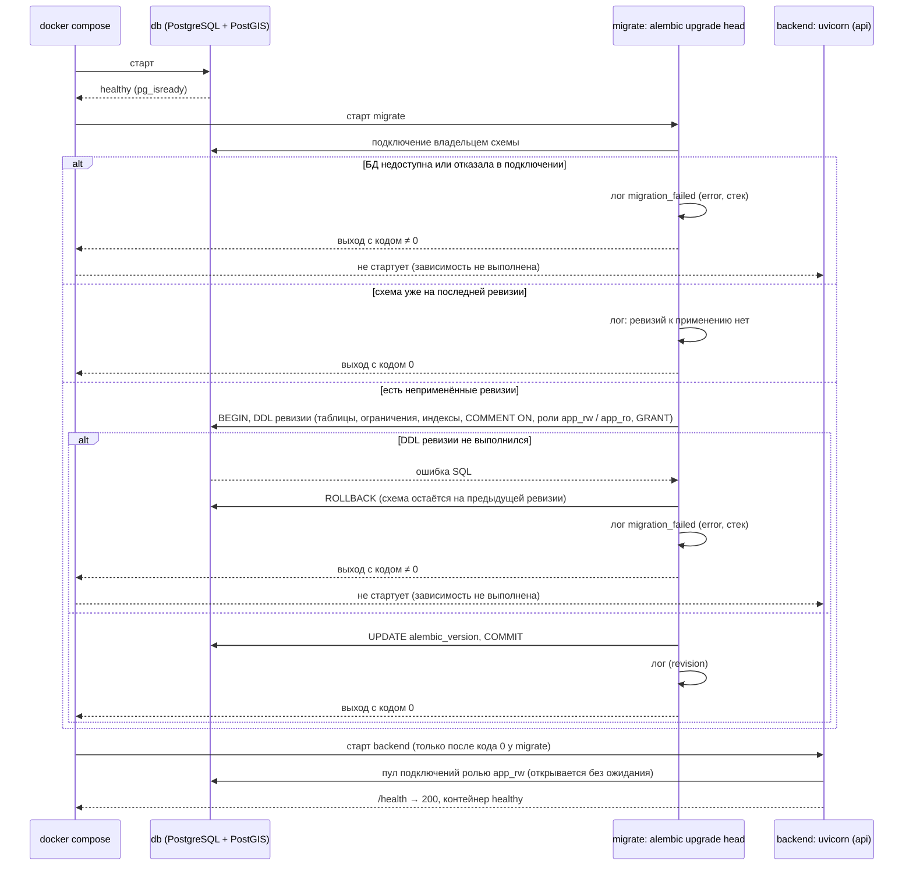

# Sequence-диаграммы — `alembic/`

## Старт стенда: миграции, затем приложение

Схема БД доводится до последней ревизии при каждом `docker compose up` отдельным разовым
сервисом `migrate` — тем же образом, что `backend`, с командой `alembic upgrade head`.
`backend` стартует только после его успешного завершения. Адрес владельца схемы
(пользователь `POSTGRES_USER` образа PostGIS) и пароли ролей есть только в окружении
`migrate`; `backend` получает один адрес — роли `app_rw`, у которой права только на
данные: приложение не может ни изменить схему, ни узнать учётные данные владельца.
`app_ro` — роль только на чтение, для ручных запросов к стенду.

Ревизия применяется в одной транзакции: ошибка на любом DDL откатывает её целиком, и
схема остаётся на предыдущей ревизии. Записи Alembic идут через stdlib `logging` и
выходят в том же JSON-формате, что и записи приложения; параметры SQL-операторов (в них
пароли ролей) в текст ошибок не попадают.

Сервис, вышедший на миграции, виден как `Exited (1)` у `migrate` в `docker compose ps -a`,
`backend` при этом в состоянии `Created`; причина — в последних строках
`docker compose logs migrate`. `/health` о состоянии схемы не сообщает: приложение с
неприменённой ревизией не запускается вовсе.

Ошибка запроса к БД во время работы приложения — ветка «БД или OSRM недоступны» общей схемы
в [`src/api/routes/sequence_diagrams.md`](../src/api/routes/sequence_diagrams.md#ошибки-любой-операции--единый-обработчик):
обёртка репозитория пишет `db_query_failed` (имя запроса aiosql, `sqlstate`) и поднимает
`DependencyUnavailable` → `503` без тела. Ошибка, которую повтор не исправит (нарушено
ограничение, неверные данные), — та же запись `db_query_failed` и `DatabaseFailure` → `500`
без тела и без повторной записи в обработчике.
