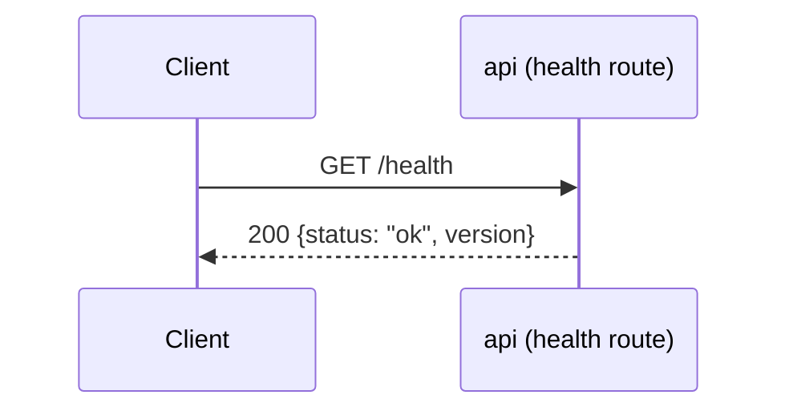
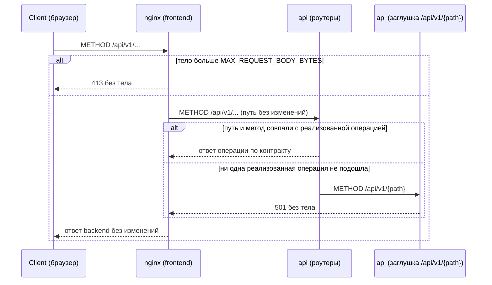
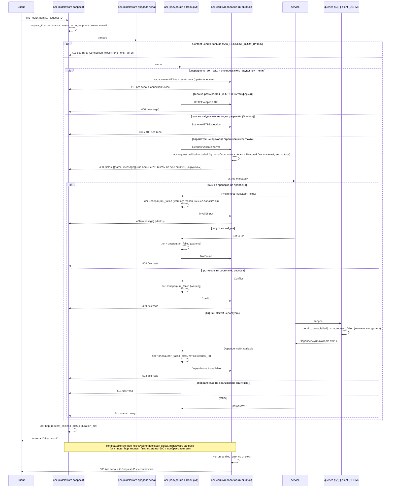

# Sequence-диаграммы — `src/api/routes/`

## `GET /health`

Liveness-проверка процесса. Ошибочных веток нет: обработчик не выполняет
ввод-вывода (не обращается к БД и не ходит в OSRM) и ничем, кроме самого
факта ответа процесса, не может завершиться иначе как `200`.

## `/api/v1/{path}` — заглушка нереализованных операций

Инфраструктура стенда, а не часть контракта: в `specs/openapi.yaml` не описана и в
генерируемую схему приложения не попадает. Принимает любой метод на любом пути под
`/api/v1`, зарегистрирована последней — роут реализованной операции объявлен раньше и
перехватывает запрос до неё. Совпадение ищется по паре «путь + метод», поэтому метод,
которого нет у реализованного пути, тоже попадает в заглушку и получает `501`, а не `405`.
Отвечает `501` без тела: текст «ещё не реализовано»
фронтенд строит по коду ответа. Когда реализована последняя операция, заглушка
удаляется, и неизвестный путь под `/api/v1` отвечает `404`.

В стенде Docker Compose запросы браузера идут через nginx фронтенда: он отдаёт
статику и проксирует `/api` в backend без изменения пути. Тело больше
`MAX_REQUEST_BODY_BYTES` nginx отклоняет сам, не передавая в backend.

## Ошибки любой операции — единый обработчик

Общая схема для всех операций, включая `/health` и заглушку `/api/v1/{path}`; диаграммы
отдельных операций показывают только свои ветки и на эту ссылаются. Тело есть только у
`400` (`ValidationError` из `specs/common.yaml`: `message` либо `fields`), остальные коды
ошибок — без тела. `X-Request-ID` есть у каждого ответа: для ответов, прошедших
middleware запроса, его ставит она, для `500` — обработчик `Exception` из `contextvars`,
потому что работает снаружи пользовательских middleware.

Порядок снаружи внутрь: middleware запроса (`request_id`, запись
`http_request_finished`) → middleware предела тела (`MAX_REQUEST_BODY_BYTES`) → валидация
FastAPI → маршрут → `service` → (`queries`-репозиторий | `client` OSRM). Предел тела
проверяется дважды: по `Content-Length` — сразу, в middleware; без него — пока операция
читает тело, и тогда `413` собирает единый обработчик. Операция, которая тело не читает
(заглушка, `404`, `405`), отвечает своим кодом. Запрос, не сопоставленный ни одному роуту,
пишется в лог с `path="<unmatched>"`, а не с присланным путём. Ошибка БД или
OSRM логируется в месте возникновения и поднимается доменным исключением; бизнес-ошибку
логирует маршрут (`<операция>_failed`) и пробрасывает дальше; ответ собирает только
единый обработчик.

