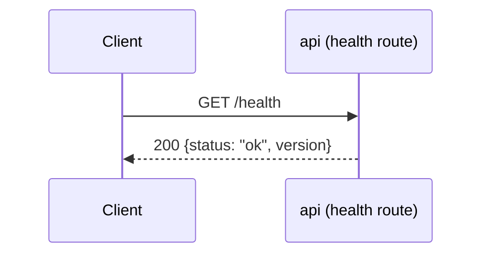

# Sequence-диаграммы — `src/api/routes/`

## `GET /health`

Liveness-проверка процесса. Ошибочных веток нет: обработчик не выполняет
ввод-вывода (не обращается к БД и не ходит в OSRM) и ничем, кроме самого
факта ответа процесса, не может завершиться иначе как `200`.

