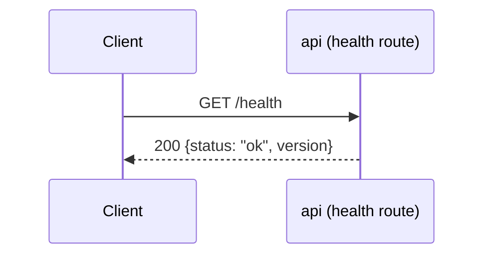
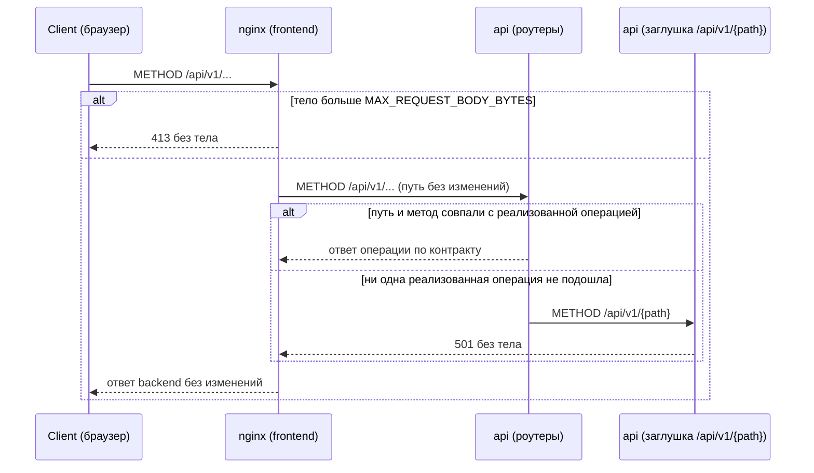
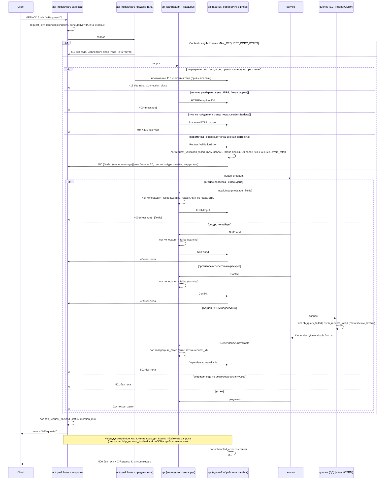
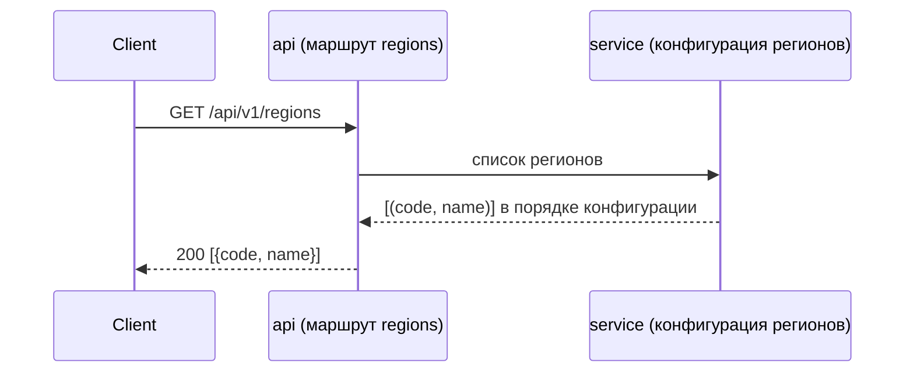
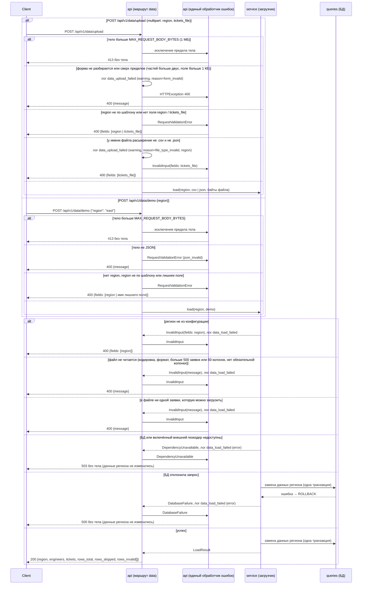
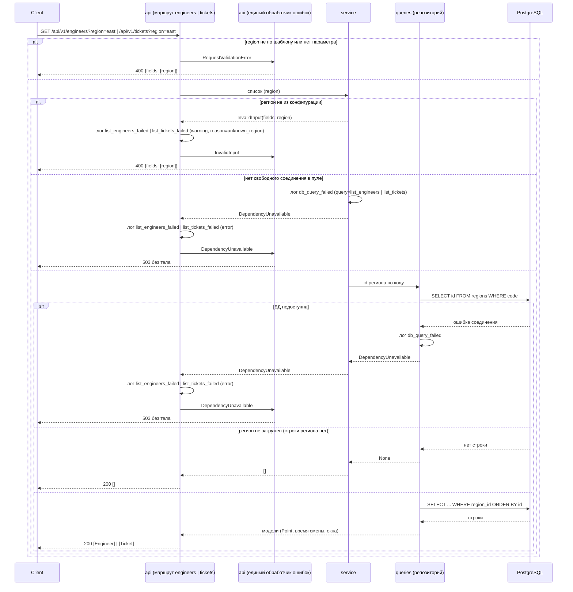

# Sequence-диаграммы — `src/api/routes/`

## `GET /health`

Liveness-проверка процесса. Ошибочных веток нет: обработчик не выполняет
ввод-вывода (не обращается к БД и не ходит в OSRM) и ничем, кроме самого
факта ответа процесса, не может завершиться иначе как `200`.

## `/api/v1/{path}` — заглушка нереализованных операций

Инфраструктура стенда, а не часть контракта: в `specs/openapi.yaml` не описана и в
генерируемую схему приложения не попадает. Принимает любой метод на любом пути под
`/api/v1`, зарегистрирована последней — роут реализованной операции объявлен раньше и
перехватывает запрос до неё. Совпадение ищется по паре «путь + метод», поэтому метод,
которого нет у реализованного пути, тоже попадает в заглушку и получает `501`, а не `405`.
Отвечает `501` без тела: текст «ещё не реализовано»
фронтенд строит по коду ответа. Когда реализована последняя операция, заглушка
удаляется, и неизвестный путь под `/api/v1` отвечает `404`.

В стенде Docker Compose запросы браузера идут через nginx фронтенда: он отдаёт
статику и проксирует `/api` в backend без изменения пути. Тело больше
`MAX_REQUEST_BODY_BYTES` nginx отклоняет сам, не передавая в backend.

## Ошибки любой операции — единый обработчик

Общая схема для всех операций, включая `/health` и заглушку `/api/v1/{path}`; диаграммы
отдельных операций показывают только свои ветки и на эту ссылаются. Тело есть только у
`400` (`ValidationError` из `specs/common.yaml`: `message` либо `fields`), остальные коды
ошибок — без тела. `X-Request-ID` есть у каждого ответа: для ответов, прошедших
middleware запроса, его ставит она, для `500` — обработчик `Exception` из `contextvars`,
потому что работает снаружи пользовательских middleware.

Порядок снаружи внутрь: middleware запроса (`request_id`, запись
`http_request_finished`) → middleware предела тела (`MAX_REQUEST_BODY_BYTES`) → валидация
FastAPI → маршрут → `service` → (`queries`-репозиторий | `client` OSRM). Предел тела
проверяется дважды: по `Content-Length` — сразу, в middleware; без него — пока операция
читает тело, и тогда `413` собирает единый обработчик. Операция, которая тело не читает
(заглушка, `404`, `405`), отвечает своим кодом. Запрос, не сопоставленный ни одному роуту,
пишется в лог с `path="<unmatched>"`, а не с присланным путём. Ошибка БД или
OSRM логируется в месте возникновения и поднимается доменным исключением; бизнес-ошибку
логирует маршрут (`<операция>_failed`) и пробрасывает дальше; ответ собирает только
единый обработчик.

## `GET /api/v1/regions`

Справочник регионов из конфигурации сервера (`data/regions.toml`), в порядке её записи.
Отвечает одинаково, загружены ли по региону данные или нет. Ввода-вывода нет: конфигурация
читается один раз, при старте приложения. Своих веток ошибок у операции нет, остаются
только общие (`500`).

## `POST /api/v1/data/upload`, `POST /api/v1/data/demo`

Обе операции заменяют данные одного региона через загрузчик. Как загрузчик читает файл,
проверяет строки, ищет координаты и пишет в БД, и какими исключениями завершается, — на
диаграмме «Загрузка данных региона» диаграмм сервисного слоя (`src/service/`). Здесь показано,
что делает HTTP-слой и какой ответ получается из каждого исключения.

Обе операции — `POST`: загрузка удаляет планы региона, а `GET` клиенты и прокси вправе
повторять сами (кэш, prefetch, повторный запрос при возврате на вкладку).

На стенде nginx ждёт ответа `/api/v1/data/upload` и `/api/v1/data/demo` до 10 минут, а не 60 с, как у остальных:
с включённым Nominatim загрузка геокодирует промахи кэша по запросу в секунду и длится минуты.

Бригады файлом не принимаются: у региона демо-бригады от генератора. Они сохраняются между
загрузками с теми же id, загрузка обновляет у них только точки старта; планы региона
удаляются.

Любую ошибку самого загрузчика он логирует сам, один раз, событием `data_load_failed`
(`reason`, `region`, `source`, `duration_ms`). Маршрут её больше не логирует. Маршрут пишет
только `data_upload_failed` — о том, что отклонил сам до вызова загрузчика: форма не
разбирается (`form_invalid`) или у файла не то расширение (`file_type_invalid`).

## `GET /api/v1/engineers`, `GET /api/v1/tickets`

Списки бригад и заявок одного региона, по возрастанию `id`, без постраничной выдачи: в
регионе не больше 500 заявок (предел файла). Сервис сначала проверяет код по
конфигурации регионов, потом находит id региона в БД по коду и читает строки по `region_id`.
Строк других регионов в ответе не бывает: запрос отбирает строки по id региона. Регион из конфигурации без загруженных
данных — пустой список, не ошибка. Репозиторий переводит геометрию в точку
`{lat, lon}`, время смены — в `ЧЧ:ММ`, окна заявок — в местное время без пояса.
Назначений заявок в списке нет, они в плане. Бизнес-ошибку маршрут логирует как
`list_engineers_failed` / `list_tickets_failed`.

