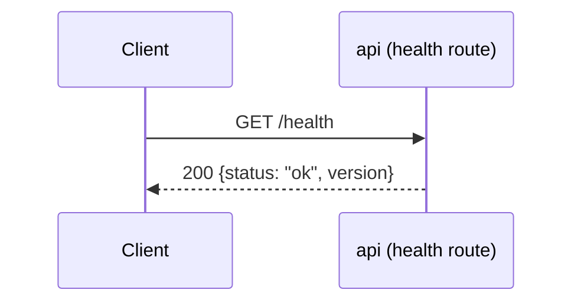
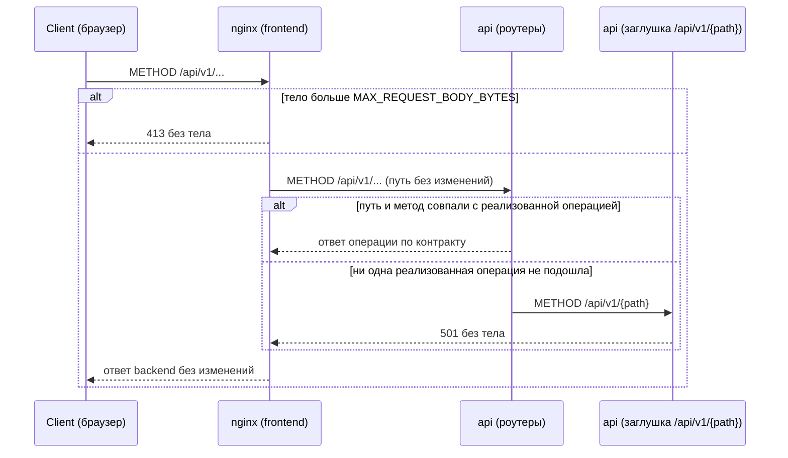

# Sequence-диаграммы — `src/api/routes/`

## `GET /health`

Liveness-проверка процесса. Ошибочных веток нет: обработчик не выполняет
ввод-вывода (не обращается к БД и не ходит в OSRM) и ничем, кроме самого
факта ответа процесса, не может завершиться иначе как `200`.

## `/api/v1/{path}` — заглушка нереализованных операций

Инфраструктура стенда, а не часть контракта: в `openapi/openapi.yaml` не описана и в
генерируемую схему приложения не попадает. Принимает любой метод на любом пути под
`/api/v1`, зарегистрирована последней — роут реализованной операции объявлен раньше и
перехватывает запрос до неё. Совпадение ищется по паре «путь + метод», поэтому метод,
которого нет у реализованного пути, тоже попадает в заглушку и получает `501`, а не `405`.
Отвечает `501` без тела: текст «ещё не реализовано»
фронтенд строит по коду ответа. Когда реализована последняя операция, заглушка
удаляется, и неизвестный путь под `/api/v1` отвечает `404`.

В стенде Docker Compose запросы браузера идут через nginx фронтенда: он отдаёт
статику и проксирует `/api` в backend без изменения пути. Тело больше
`MAX_REQUEST_BODY_BYTES` nginx отклоняет сам, не передавая в backend.

