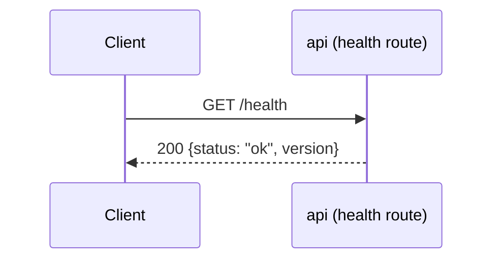
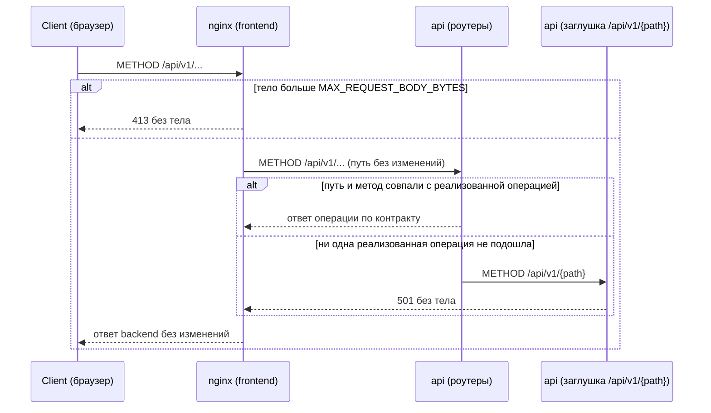
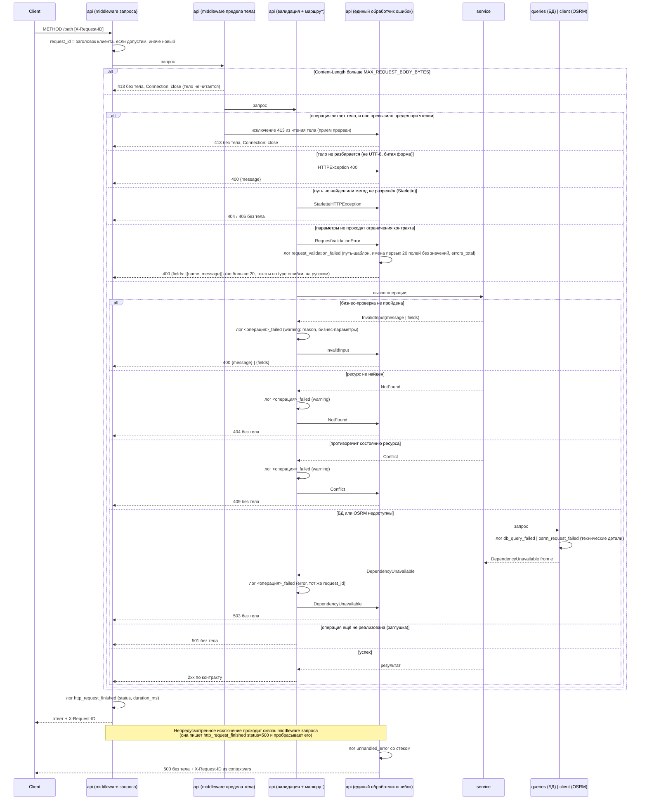
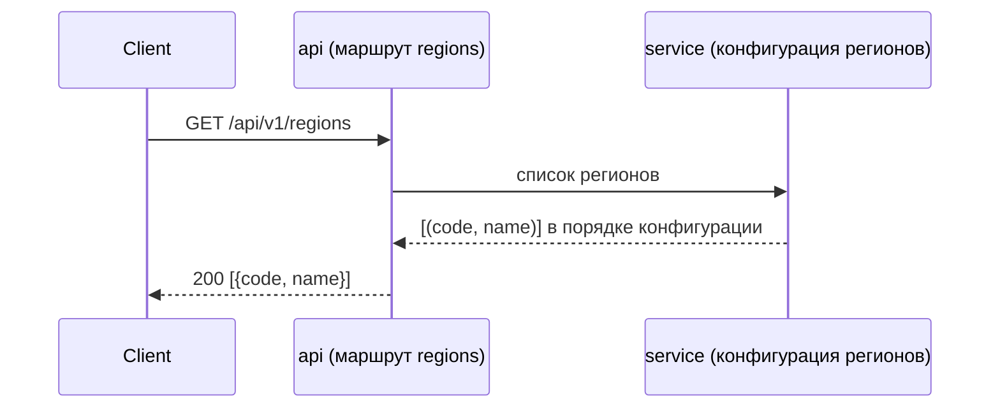
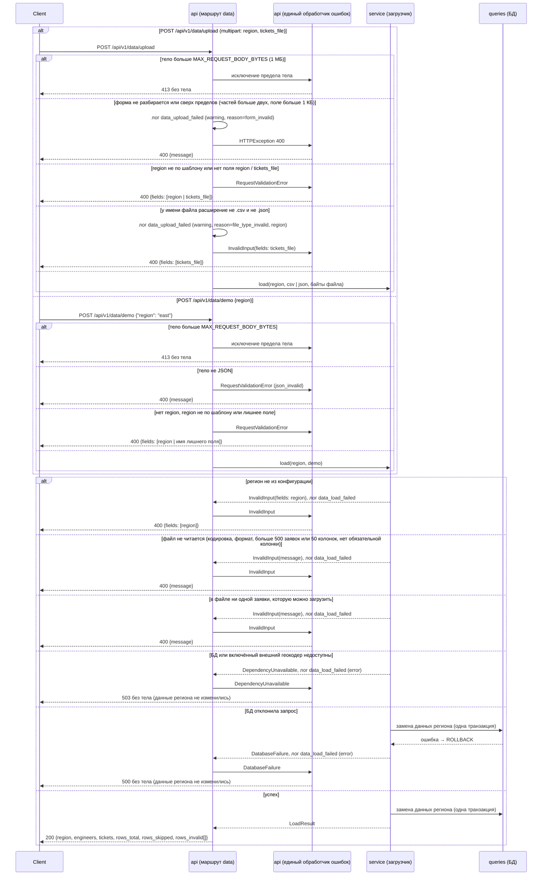
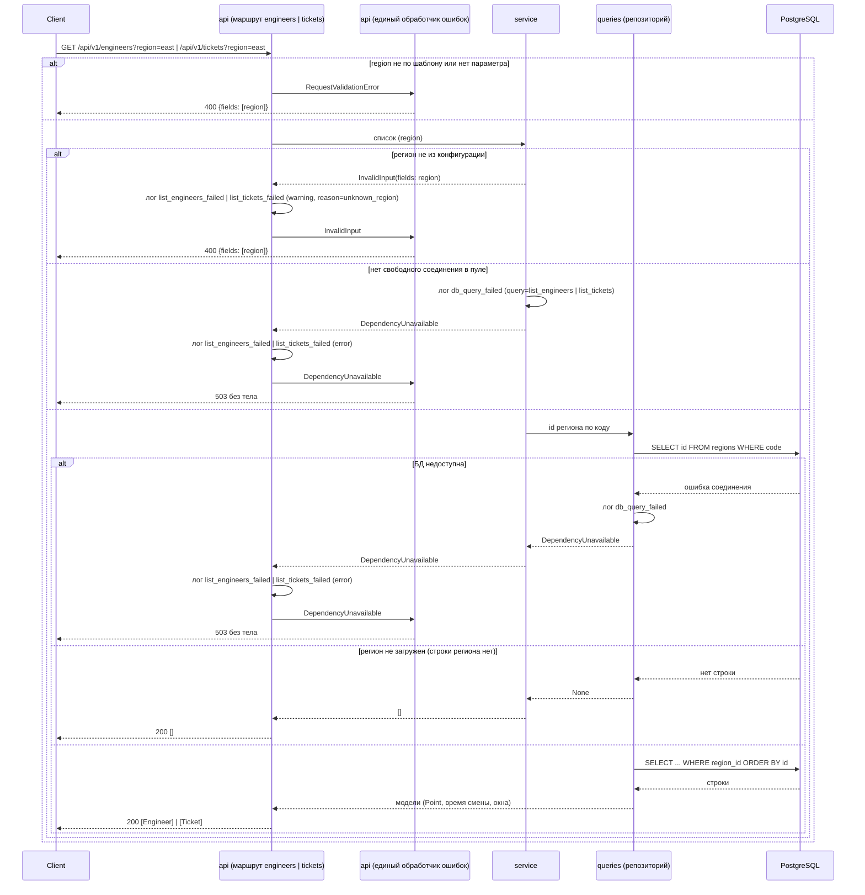
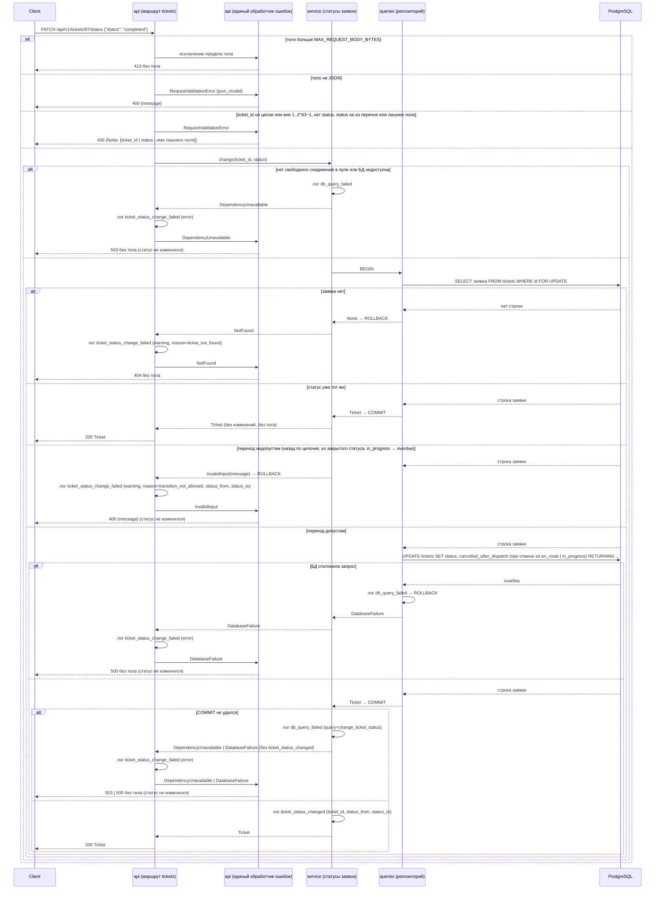
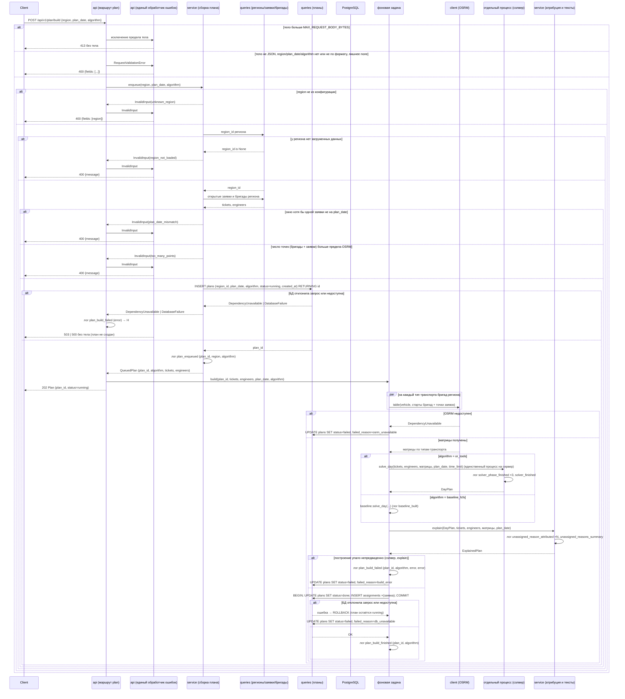
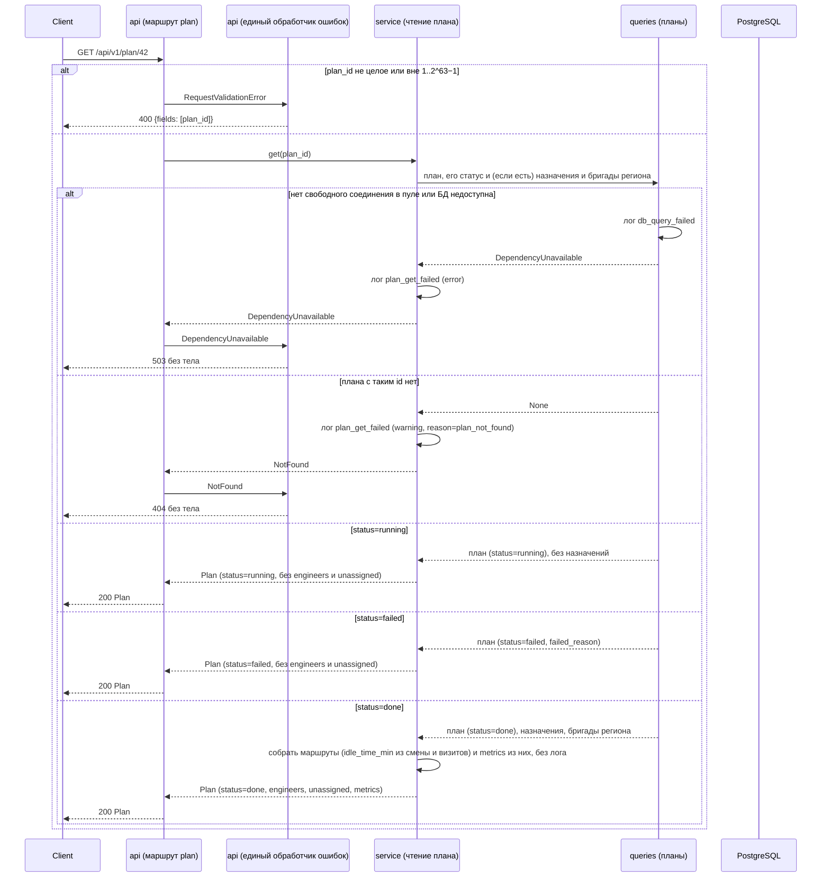
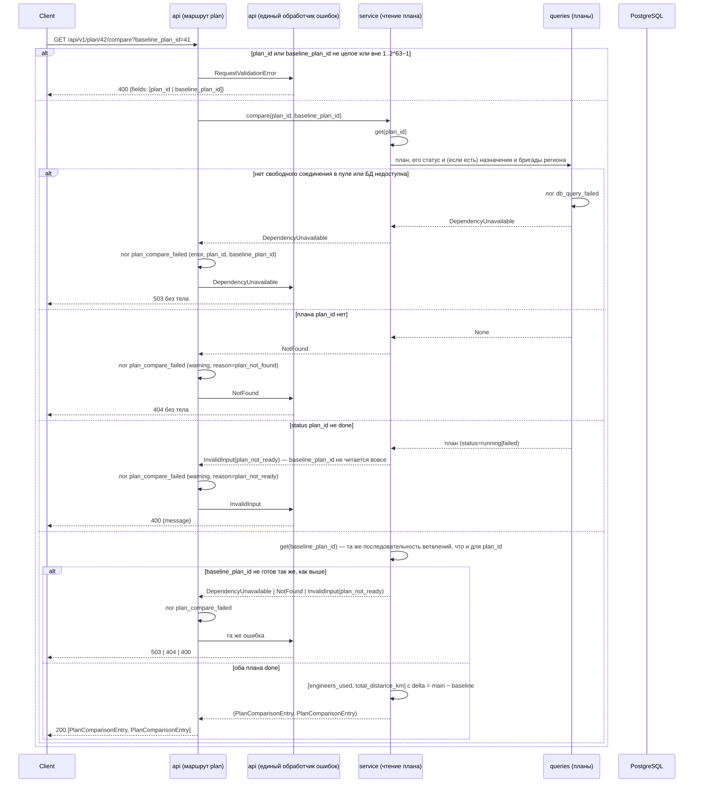

# Sequence-диаграммы — `src/api/routes/`

## `GET /health`

Liveness-проверка процесса. Ошибочных веток нет: обработчик не выполняет
ввод-вывода (не обращается к БД и не ходит в OSRM) и ничем, кроме самого
факта ответа процесса, не может завершиться иначе как `200`.

## `/api/v1/{path}` — заглушка нереализованных операций

Инфраструктура стенда, а не часть контракта: в `specs/openapi.yaml` не описана и в
генерируемую схему приложения не попадает. Принимает любой метод на любом пути под
`/api/v1`, зарегистрирована последней — роут реализованной операции объявлен раньше и
перехватывает запрос до неё. Совпадение ищется по паре «путь + метод», поэтому метод,
которого нет у реализованного пути, тоже попадает в заглушку и получает `501`, а не `405`.
Отвечает `501` без тела: текст «ещё не реализовано»
фронтенд строит по коду ответа. Когда реализована последняя операция, заглушка
удаляется, и неизвестный путь под `/api/v1` отвечает `404`.

В стенде Docker Compose запросы браузера идут через nginx фронтенда: он отдаёт
статику и проксирует `/api` в backend без изменения пути. Тело больше
`MAX_REQUEST_BODY_BYTES` nginx отклоняет сам, не передавая в backend.

## Ошибки любой операции — единый обработчик

Общая схема для всех операций, включая `/health` и заглушку `/api/v1/{path}`; диаграммы
отдельных операций показывают только свои ветки и на эту ссылаются. Тело есть только у
`400` (`ValidationError` из `specs/common.yaml`: `message` либо `fields`), остальные коды
ошибок — без тела. `X-Request-ID` есть у каждого ответа: для ответов, прошедших
middleware запроса, его ставит она, для `500` — обработчик `Exception` из `contextvars`,
потому что работает снаружи пользовательских middleware.

Порядок снаружи внутрь: middleware запроса (`request_id`, запись
`http_request_finished`) → middleware предела тела (`MAX_REQUEST_BODY_BYTES`) → валидация
FastAPI → маршрут → `service` → (`queries`-репозиторий | `client` OSRM). Предел тела
проверяется дважды: по `Content-Length` — сразу, в middleware; без него — пока операция
читает тело, и тогда `413` собирает единый обработчик. Операция, которая тело не читает
(заглушка, `404`, `405`), отвечает своим кодом. Запрос, не сопоставленный ни одному роуту,
пишется в лог с `path="<unmatched>"`, а не с присланным путём. Ошибка БД или
OSRM логируется в месте возникновения и поднимается доменным исключением; бизнес-ошибку
логирует маршрут (`<операция>_failed`) и пробрасывает дальше; ответ собирает только
единый обработчик.

## `GET /api/v1/regions`

Справочник регионов из конфигурации сервера (`data/regions.toml`), в порядке её записи.
Отвечает одинаково, загружены ли по региону данные или нет. Ввода-вывода нет: конфигурация
читается один раз, при старте приложения. Своих веток ошибок у операции нет, остаются
только общие (`500`).

## `POST /api/v1/data/upload`, `POST /api/v1/data/demo`

Обе операции заменяют данные одного региона через загрузчик. Как загрузчик читает файл,
проверяет строки, ищет координаты и пишет в БД, и какими исключениями завершается, — на
диаграмме «Загрузка данных региона» диаграмм сервисного слоя (`src/service/`). Здесь показано,
что делает HTTP-слой и какой ответ получается из каждого исключения.

Обе операции — `POST`: загрузка удаляет планы региона, а `GET` клиенты и прокси вправе
повторять сами (кэш, prefetch, повторный запрос при возврате на вкладку).

На стенде nginx ждёт ответа `/api/v1/data/upload` и `/api/v1/data/demo` до 10 минут, а не 60 с, как у остальных:
с включённым Nominatim загрузка геокодирует промахи кэша по запросу в секунду и длится минуты.

Бригады файлом не принимаются: у региона демо-бригады от генератора. Они сохраняются между
загрузками с теми же id, загрузка обновляет у них только точки старта; планы региона
удаляются.

Любую ошибку самого загрузчика он логирует сам, один раз, событием `data_load_failed`
(`reason`, `region`, `source`, `duration_ms`). Маршрут её больше не логирует. Маршрут пишет
только `data_upload_failed` — о том, что отклонил сам до вызова загрузчика: форма не
разбирается (`form_invalid`) или у файла не то расширение (`file_type_invalid`).

## `GET /api/v1/engineers`, `GET /api/v1/tickets`

Списки бригад и заявок одного региона, по возрастанию `id`, без постраничной выдачи: в
регионе не больше 500 заявок (предел файла). Сервис сначала проверяет код по
конфигурации регионов, потом находит id региона в БД по коду и читает строки по `region_id`.
Строк других регионов в ответе не бывает: запрос отбирает строки по id региона. Регион из конфигурации без загруженных
данных — пустой список, не ошибка. Репозиторий переводит геометрию в точку
`{lat, lon}`, время смены — в `ЧЧ:ММ`, окна заявок — в местное время без пояса.
Назначений заявок в списке нет, они в плане. Бизнес-ошибку маршрут логирует как
`list_engineers_failed` / `list_tickets_failed`.

## `PATCH /api/v1/tickets/{ticket_id}/status`

Диспетчер меняет статус заявки по сообщению бригады. Допустимые переходы:

| Из | В |
|---|---|
| `not_sent` | `sent`, `en_route`, `in_progress`, `completed`, `cancelled`, `overdue` |
| `sent` | `en_route`, `in_progress`, `completed`, `cancelled`, `overdue` |
| `en_route` | `in_progress`, `completed`, `cancelled`, `overdue` |
| `in_progress` | `completed`, `cancelled` |
| `overdue` | `en_route`, `in_progress`, `completed`, `cancelled` |
| `completed`, `cancelled` | — (закрытые статусы) |

Вперёд по цепочке `not_sent → sent → en_route → in_progress → completed` можно и через
шаг: диспетчер отмечает то, о чём сообщила бригада, а промежуточные сообщения могли не
дойти. Назад по цепочке и из закрытого статуса — нельзя: закрытая заявка финальна и в
перепланировании не участвует. Тот же статус, что у заявки уже есть, — `200` без
изменений, так что повтор запроса после обрыва связи безопасен.

Отмена из `en_route` или `in_progress` ставит у заявки `cancelled_after_dispatch`: выезд
бригады уже потрачен и учитывается в метриках плана. Построенные планы операция не меняет.

Чтение статуса, проверка перехода и запись — в одной транзакции, строка заявки
блокируется (`SELECT ... FOR UPDATE`): два одновременных запроса к одной заявке
выполняются по очереди, и второй проверяет переход от статуса, записанного первым.

Изменение сервис логирует после фиксации транзакции событием `ticket_status_changed`
(`ticket_id`, `status_from`, `status_to`); запрос без изменения его не пишет. Отказ маршрут
логирует один раз событием `ticket_status_change_failed` (`ticket_id`, `reason`; при
недопустимом переходе ещё `status_from`, `status_to`).

## `POST /api/v1/plan/build`

Ставит построение плана региона на дату в очередь и отвечает, не дожидаясь его конца:
проверяет заявки и предел точек синхронно, вставляет строку плана со `status = running` и
возвращает её клиенту — чтение открытых заявок и бригад региона, обращение к OSRM, выбранный
алгоритм (`or_tools` — трёхфазная лексикографическая оптимизация в отдельном процессе,
`baseline_fcfs` — в фоновой задаче того же процесса: не блокирует GIL дольше нескольких мс на
максимальном входе), атрибуция причин отказа и запись результата идут в фоновой задаче уже
после ответа. Клиент узнаёт результат, опрашивая `GET /api/v1/plan/{plan_id}`, пока `status`
не станет `done` или `failed`. Каждый вызов создаёт новый план — раньше построенные планы
региона не трогает.

Бизнес-проверки до постановки в очередь: код региона есть в конфигурации и у региона есть
загруженные данные (иначе строить план не по чему); окно каждой открытой заявки региона
приходится на `plan_date` (иначе смены бригад на `plan_date` не совпадают с окнами
заявок, и план не имеет смысла); число точек будущей матрицы (бригады + заявки) не
больше предела OSRM-сервера. Эти проверки — единственное, что может вернуть `400`: сама
постановка в очередь предполагает, что план будет считаться, и вернуться `202` может либо
она, либо отказ БД при вставке строки плана.

Общего дедлайна на всё построение больше нет: раз ответ клиенту уже отправлен, обращение к
OSRM ограничено собственным таймаутом HTTP-клиента, а солвер — своим `time_limit`. Основной
алгоритм выполняется в пуле из одного процесса на весь сервер — конкурентное построение
встаёт в очередь исполнителя, а не запускается параллельно вторым процессом; на очередь эта
операция не отвечает клиенту вообще, поскольку она уже ответила `202` раньше.

Построение логируется `plan_enqueued` (синхронно с ответом `202`) и
`plan_build_finished`/`plan_build_failed` (в фоновой задаче, когда расчёт закончился), оба с
`plan_id`: по нему в логах находятся записи `osrm_request_finished`/`_failed` и
`solver_finished`/`solver_phase_finished` того же построения. Открытые заявки и бригады
региона читаются один раз, при постановке в очередь: фоновая задача получает их напрямую
аргументом, а не читает заново, — только что прочитанные записи не могут разойтись с тем,
что уже проверено бизнес-проверками.

## `GET /api/v1/plan/{plan_id}`

Читает сохранённую запись плана — без обращения к OSRM или солверу. Ответ
всегда `200 Plan` с полем `status`; клиент отличает состояния по этому полю,
а не по коду ответа:

- `status=running` — построение ещё не завершилось (фоновая задача из
  `POST /plan/build` продолжает работать); `engineers` и `unassigned`
  в ответе отсутствуют.
- `status=done` — построение завершилось успешно; `engineers`, `unassigned`
  и `metrics` заполнены. Маршруты, объяснения и причины неназначенных
  заявок — уже сохранённые данные построения; простой (`idle_time_min`) и
  все поля `metrics` пересчитываются из смены и сохранённых визитов при
  чтении, не хранятся отдельно.
- `status=failed` — построение завершилось ошибкой; заполнено
  `failed_reason`, `engineers` и `unassigned` отсутствуют.

Клиент опрашивает этот эндпоинт с паузой между запросами, пока `status` не
станет `done` или `failed`.

## `GET /api/v1/plan/{plan_id}/compare`

Сравнивает `metrics` двух планов (`plan_id` из пути и `baseline_plan_id` из
query) по каждой обязательной метрике — `engineers_used`, `total_distance_km`
— и отвечает разницей. Оба плана читаются тем же методом, что отвечает на
`GET /api/v1/plan/{plan_id}` (`Svc.get`), по одному за раз: сперва `plan_id`,
и только если он готов — `baseline_plan_id`, так что проблема с главным
планом никогда не трогает baseline вовсе. План не готов к сравнению, если у
него ещё нет `metrics` (`status` не `done`). Разница считается тем же
сервисом, а не маршрутом — маршрут только переводит доменный результат в
контракт.

