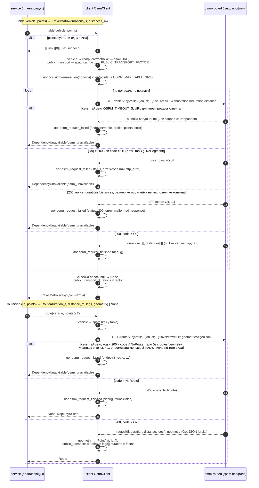

# Sequence-диаграммы — `src/clients/`

## Время и расстояние в пути (OSRM)

Клиент OSRM даёт планировщику две вещи: матрицу «время / расстояние в пути» между точками
(`/table`) и маршрут через последовательность точек с геометрией для карты (`/route`). Оба
считаются только по графу дорог; прямая между точками не используется ни как основной
способ, ни как запасной. Своей операции API у клиента нет: его вызывают построение плана и
перепланирование, а отказ OSRM они отдают как `503` по общей схеме ошибок.

**Профиль транспорта бригады → граф.** Каждый из `car`, `foot`, `bike` — свой граф дорог и
свой экземпляр `osrm-routed` (URL в настройках: `OSRM_URL_CAR`, `OSRM_URL_FOOT`,
`OSRM_URL_BIKE`): один `osrm-routed` обслуживает ровно один профиль, профиль в пути
запроса он не читает. `public_transport` своего графа не имеет: время — время профиля
`car`, умноженное на коэффициент `PUBLIC_TRANSPORT_FACTOR` (по умолчанию 1,5, не меньше
1), расстояние — расстояние `car` без изменений. Коэффициент — усреднённая оценка
пересадок, ожиданий и пешей части пути, а не расчёт маршрута общественного транспорта.

**Единицы и порядок координат.** Ответ клиента — секунды и метры, как у OSRM (дробные);
округление до минут — дело планировщика. Точка — `Point(lat, lon)`; в URL OSRM
координаты идут в порядке `lon,lat`, с пятью знаками после запятой (около метра). Строка
и столбец матрицы `i` — точка `i` входного списка.

**Нет маршрута между парой точек** (точки в несвязанных частях графа): ячейка матрицы —
`None`, для `/route` — результат `None`. Клиент не подставляет вместо неё ни прямую, ни
ноль: переход между такими точками для планировщика невозможен.

**Размер матрицы.** `osrm-routed` отклоняет таблицу, у которой источников × назначений
больше квадрата его `--max-table-size` (на стенде — 1000, в настройках клиента
`OSRM_MAX_TABLE_SIZE` — то же значение). Если точек больше, клиент запрашивает матрицу
полосами строк: все точки — назначения, в полосе столько источников, чтобы произведение
укладывалось в предел; полосы склеиваются по порядку. Пустой список точек — пустая
матрица, одна точка — матрица `[[0]]`, обе без запроса: таблицу из одной точки
`osrm-routed` отклоняет. Точек в матрице дня — заявки файла (не больше 500) и старты
бригад региона (не больше 30): до 530 точек, один запрос с URL около 10 КБ.

**Отказ OSRM.** Сетевая ошибка, таймаут (`OSRM_TIMEOUT_S`, по умолчанию 60 с на запрос:
матрица из 530 точек на графе `bike` считается до ~26 с), URL длиннее предела HTTP-клиента, код
ответа не 200 или `code` в теле не `Ok`, тело без ожидаемых полей или с числом не того
вида (не число, бесконечность, `NaN`), матрица или маршрут не того размера (у маршрута
участков на один меньше, чем точек, в геометрии не меньше двух точек) —
`DependencyUnavailable(reason="osrm_unavailable")`, одна запись `osrm_request_failed` на
месте; отвергнутый ответ не пишется как выполненный запрос. Единственное исключение — `NoRoute` у `/route`: это не
отказ, а «нет маршрута» (см. выше). Отказ одного профиля (граф `foot` ещё строится) не
затрагивает запросы других профилей. Ответ полосы, пришедший с ошибкой, отменяет весь
запрос матрицы: неполная матрица не возвращается.

**Логи.** `osrm_request_finished` (`debug`) и `osrm_request_failed` (`error`) — одна из двух на
каждый HTTP-запрос к OSRM, с полями `endpoint` (`table`/`route`), `profile` (граф, в
который ушёл запрос), `points`, `status`, `duration_ms`; при отказе ещё `error`: класс
исключения, `code` из тела, `http_error` (код не 200 и тело не JSON) или
`malformed_response`. Координат в записях нет: точка заявки — это адрес клиента.

