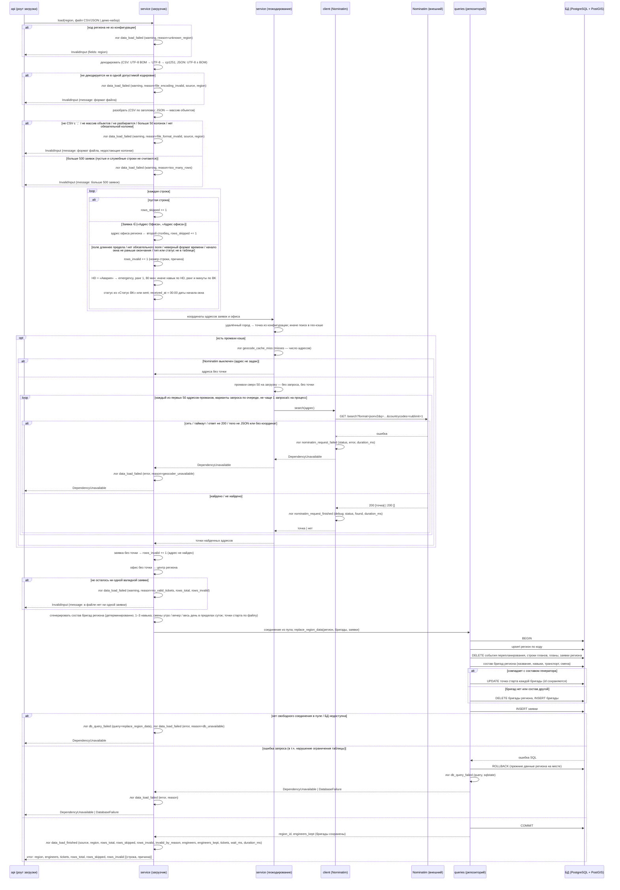
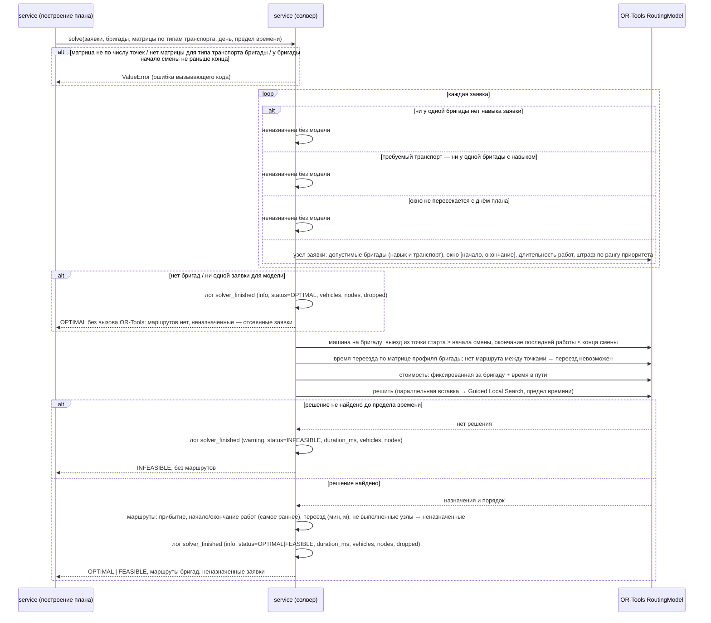
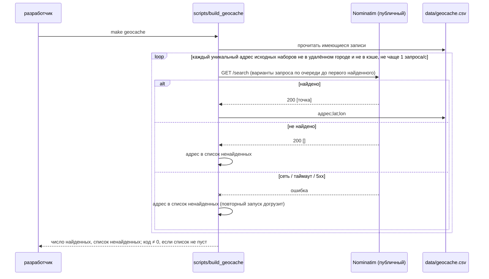

# Sequence-диаграммы — `src/service/`

## Загрузка данных региона

Загрузчик принимает файл заявок одного региона (CSV или JSON) либо встроенный демо-набор
региона и записывает регион, его бригады и заявки в БД. Вызывает его HTTP-слой
(`POST /data/upload`, `POST /data/demo`); коды ответов этих операций — на их диаграммах в
`src/api/routes/`, здесь — исключения сервиса, из которых они получаются по общей схеме
ошибок.

**Регион** выбирает вызывающий по коду (`east`, `south_east`, `south_center`). Код,
название и запасная точка офиса (центр региона) — в конфигурации регионов, не в файле.
Неизвестный код отклоняется до чтения файла.
Все заявки файла относятся к выбранному региону: регион — это один файл.

**Чтение файла.** CSV — разделитель `;`, поля определяются по строке заголовка, а не по
позиции: набор колонок различается между регионами. Из строки сохраняются только колонки,
которые использует загрузчик; заголовок больше 50 колонок — ошибка формата файла: работа над
строкой не должна расти с числом объявленных колонок. Кодировка определяется по содержимому:
файл, начинающийся с UTF-8 BOM, — UTF-8 без BOM; иначе строгий UTF-8; иначе cp1251. Порядок
существен: cp1251 декодирует почти любую последовательность байтов, а кириллица в cp1251
почти никогда не бывает корректным UTF-8. JSON — массив объектов, ключи которых совпадают с
заголовками CSV; только UTF-8, с BOM или без. Файл, который не разбирается как CSV или JSON
(в том числе поле CSV больше предела библиотеки, слишком глубокая вложенность или слишком
длинное число в JSON), — ошибка формата файла.

**Размер файла.** Файл — день региона: все его заявки идут в одну матрицу времени в пути и
один запуск солвера. Файл больше чем с 500 заявками отклоняется целиком; 30 бригад региона
выполняют за день около 300 заявок, остальное — запас на нехватку бригад. Пустые строки и
служебная строка (см. ниже) заявками не считаются и в памяти не держатся — только считаются:
файл из одних пустых строк занимает память не больше файла без них. Разбор выполняется вне
event loop: файл до 1 МБ — это работа процессора, а не ожидание.

**Строки, которые не являются заявками**, отбрасываются до проверки полей и учитываются в
`rows_skipped`: пустые строки и служебная строка, у которой `Заявка` — «Адрес Офиса» или
«Адрес офиса» (регистр между файлами не совпадает). Из служебной строки берётся адрес офиса
региона — он во втором столбце. Без служебной строки офис — центр региона, а адрес офиса —
название региона; адрес офиса, не найденный геокодированием, тоже даёт центр региона.

**Строка-заявка** проверяется по отдельности. Невалидная строка не загружается, не
прерывает загрузку остальных и учитывается в `rows_invalid` с номером строки и причиной:

- поле длиннее предела: адрес — 300 символов, остальные поля — 200;
- нет обязательного поля (`Заявка`, `Тип заявки HD`, `Начало`, `Окончание`, `Адрес`);
- время не в формате `ДД.ММ.ГГГГ Ч:ММ` (час — одна или две цифры: у аварий в исходных
  данных `0:01`) или начало окна не раньше окончания;
- тип заявки отсутствует в таблице соответствия типов;
- значение «Статус BK» отсутствует в таблице соответствия статусов;
- адрес не найден ни в гео-кэше, ни внешним геокодером — заявка без точки не загружается.

**Тип заявки → навык, приоритет, длительность** — по конфигурируемой таблице
соответствия, а не в коде. `Тип заявки HD` = «Авария» даёт навык `emergency`, ранг
приоритета 1 и 80 минут на объекте при любом `Тип заявки BK`. Остальные значения HD дают
навык по таблице, а вид работ (приоритет и минуты на объекте) — по `Тип заявки BK`:
подключение — ранг 2, 70 мин; дозаказ — ранг 3, 20 мин; локальная заявка и прочая
«Глобальная проблема» — ранг 3, 30 мин.

**Статус и момент поступления.** Статус — из колонки «Статус BK» по таблице соответствия
статусов, без колонки — `sent`. Момент поступления — 00:00 даты начала окна: все заявки
файла известны на начало дня. Часы сервера не используются, время нигде не переводится
между поясами.

**Координаты.** Адрес в удалённом городе Подмосковья (Домодедово, Кашира, Ступино — по
району или по названию города в адресе) получает точку города из конфигурации регионов:
такие города обслуживаются как одна точка, а Nominatim по названию города может вернуть,
например, аэропорт. Остальные адреса — сначала статический гео-кэш (`data/geocache.csv`,
собирается разово скриптом по адресам исходных наборов и коммитится). Кэш покрывает каждый
адрес синтетических и контрольных наборов, поэтому демо-набор и файлы исходных наборов
загружаются без доступа к интернету и при выключенном Nominatim. Промах кэша — запрос к
Nominatim, если его адрес задан в настройках; пустой адрес — внешний геокодер выключен, и
промах сразу делает строку невалидной. Запросы к Nominatim идут не чаще одного в секунду на
процесс — при любом числе одновременных загрузок, с User-Agent приложения; найденная точка
живёт в памяти до конца загрузки. За одну загрузку в Nominatim уходит не больше 50
адресов-промахов (настройка): на адрес может понадобиться несколько вариантов запроса, а
публичный сервис запрещает массовое геокодирование; адреса сверх предела остаются без точки.
В запрос не попадают квартира, подъезд, этаж и офис. На стенде Nominatim по умолчанию
выключен. Nominatim недоступен или ответил не результатом поиска (сеть, таймаут, любой код,
кроме `200`, в том числе `403` и `429`; тело не JSON или без координат) — загрузка
прерывается целиком как отказ зависимости: иначе все адреса вне кэша молча стали бы
невалидными строками.

**Бригады** даёт генератор демо-бригад; файла бригад загрузчик не принимает. Генератор
детерминирован: для региона он всегда даёт один и тот же состав — названия, навыки,
транспорт, смены; число бригад — из конфигурации региона, не больше 30: конфигурация с большим
числом отклоняется при чтении. От файла зависят только точки старта (офис и удалённые города,
см. ниже). Поэтому бригады создаются при первой загрузке данных региона и сохраняются при
повторных — с теми же id, пока их состав не меняется; повторная загрузка обновляет у них
только точку старта. У каждой бригады от 1 до 3 навыков, в наборе
встречаются все три навыка и все четыре типа транспорта. Смены — три вида, часы и доля
бригад каждого вида задаются в конфигурации региона:

| Смена | Часы | Доля бригад |
|---|---|---|
| утренняя | 10:00–18:00 | 25 % |
| вечерняя | 15:30–23:30 | 25 % |
| весь день | 10:00–23:30 | остальные, не меньше половины |

Число бригад вида — доля от числа бригад региона с округлением вниз; остаток получает
«весь день». Конец вечерней смены и смены «весь день» — 23:30: прибытие возможно в любой
момент последнего окна (до 22:00), и работа на объекте (не больше 80 минут) успевает
закончиться в смене. Бригады «весь день» вместе имеют все три навыка и все четыре типа
транспорта: заявку любого окна по навыку и транспорту может взять хотя бы одна бригада,
какие бы смены ни достались остальным; для этого бригад «весь день» не меньше четырёх.
Каждая смена лежит в пределах одних суток, начало раньше конца. Конфигурация, нарушающая
любое из этих условий, отклоняется при чтении. Старт — из офиса региона; для каждого
удалённого города Подмосковья, встречающегося в районах заявок (Домодедово, Кашира,
Ступино), одна бригада со сменой «весь день» стартует из точки этого города.

**Запись в БД** — соединение из пула берётся только здесь, после разбора и геокодирования:
медленный геокодер не держит соединение. Одна транзакция: регион создаётся или обновляется
по коду; события перепланирования, строки планов, планы и заявки региона удаляются — планы
ссылаются на заявки, которых больше нет; новые заявки вставляются. Сохранённые бригады
сравниваются с составом генератора по названию, навыкам, транспорту и смене каждой бригады:
если состав тот же, у каждой обновляется точка старта, и id сохраняются; если бригад ещё нет
или состав другой (в конфигурации региона изменились число бригад, часы или доли смен),
бригады региона удаляются и вставляются заново.

Ошибка любого запроса откатывает транзакцию целиком: в БД остаются прежние данные региона.

**Две очереди: разбор и запись.** Файлы разбираются по одному: разбор занимает память и
процессор (с удержанием GIL). Записи в БД тоже идут по одной, и загрузки занимают не больше
одного соединения пула, сколько бы их ни пришло сразу. Геокодирование — вне очередей:
запросы к Nominatim и так разнесены клиентом, а загрузка без промахов кэша не ждёт чужую с
промахами. Файл до 1 МБ разбирается целиком (`json.loads` для JSON); строки CSV из пустых
или пробельных ячеек только считаются, без разбора по колонкам.

Файл, в котором после отбора не осталось ни одной валидной заявки, отклоняется целиком:
загружать регион без заявок бессмысленно, а прежние данные при этом стирались бы.

Каждый отказ загрузки пишется здесь одной записью `data_load_failed` с `reason` и
`duration_ms`: ошибка
входных данных (неизвестный регион, файл, ноль заявок) — на уровне `warning`, отказ БД или
геокодера — `error`; роут её не повторяет.

В записях лога — счётчики и коды причин, без адресов и текста строк: адрес заявки —
персональные данные. Причина невалидной строки уходит вызывающему в итоге загрузки, а не в
лог.

## Построение плана дня: модель солвера (один проход)

Солвер назначает заявки одного региона и одного дня бригадам этого региона и строит порядок
посещения. Это чистая функция: на вход — заявки, бригады, матрицы времени и расстояния в
пути и день плана, на выход — маршрут каждой бригады и список неназначенных заявок. Сам
солвер не ходит ни в БД, ни в OSRM: заявки и бригады выбирает, а матрицы запрашивает у OSRM
сервис построения плана, он же вызывает солвер вне event loop — решение занимает процессор
на всё отведённое время. Решение — один прогон OR-Tools RoutingModel с целевой функцией из
трёх слагаемых разного масштаба; ступенчатая оптимизация в три фазы строится поверх этой же
модели.

**Время** — целые минуты от полуночи дня плана; наивное локальное время региона, без
перевода между поясами. Время в пути из матрицы (секунды) округляется вверх до целой минуты:
план не обещает прибытие раньше, чем бригада доедет. Все моменты плана — с точностью до
минуты.

**Узлы.** Точка старта каждой бригады и точка каждой заявки. Матрица каждого типа транспорта
бригад — по одним и тем же точкам в одном порядке: сначала старты бригад, затем заявки.
Бригада с общественным транспортом получает матрицу профиля `car` с коэффициентом — это
делает клиент OSRM. Пара точек без маршрута по графу — переезд между ними невозможен.

**Бригада = одна «машина» OR-Tools.** Маршрут начинается в точке старта бригады не раньше
начала её смены и заканчивается окончанием работ на последней заявке не позже конца смены:
переезды и работы на объектах укладываются в смену. Обратный путь к точке старта в
занятость не входит — маршрут открытый.

**Допустимость заявки для бригады** — жёсткое ограничение, не штраф: у бригады есть
требуемый навык заявки и, если заявка требует тип транспорта, у бригады именно он. Заявку,
для которой нет ни одной допустимой бригады, солвер не рассматривает и сразу возвращает
неназначенной.

**Временное окно** — жёсткое: работа на заявке начинается внутри `[window_start,
window_end]`. Бригада, приехавшая раньше начала окна, ждёт. Прибытие = окончание
предыдущей работы (или выезд из точки старта) + время в пути по матрице профиля бригады;
норматив «дорога 20 мин» не используется. Длительность работ — `duration_min` заявки. Окно,
не пересекающееся с днём плана, делает заявку неназначаемой.

**Частичное покрытие.** Любую заявку солвер может оставить без назначения со штрафом по её
приоритету. Штраф заявки более срочного ранга больше суммы штрафов всех заявок менее срочных
рангов: ни одна авария не остаётся неназначенной ради любого числа подключений, ни одно
подключение — ради ремонтов и дозаказов.

**Целевая функция** — сумма трёх слагаемых, масштабы которых не перекрываются: штрафы за
неназначенные заявки ≫ фиксированная стоимость каждой задействованной бригады ≫ суммарное
время в пути. Самый малый штраф больше стоимости всех бригад вместе со всем временем в пути
дня; стоимость одной бригады больше всего времени в пути дня. Это приближение к иерархии
«покрытие → число бригад → время в пути»: гарантию даёт только ступенчатая оптимизация.

**Поиск:** первое решение — параллельная вставка по наименьшей стоимости, затем Guided Local
Search до предела времени, заданного вызывающим. Решение, найденное до предела, возвращается
как `FEASIBLE`, доказанный оптимум — `OPTIMAL`. Если до предела не найдено ни одного решения,
солвер возвращает `INFEASIBLE` без маршрутов, а что делать с этим, решает вызывающий: план
«все заявки не назначены» из-за нехватки времени на поиск выглядел бы как настоящий.

**Результат.** Для каждой бригады — упорядоченные визиты: заявка, плановое прибытие, начало
и окончание работ, время (минуты) и расстояние (метры) переезда к ней; бригада без визитов в плане не
задействована. Начало работ — самое раннее, допустимое маршрутом. Для неназначенных — id
заявки; причину отказа определяет отдельная процедура атрибуции, а не солвер. Без бригад
или без единой заявки, которую можно отдать модели, OR-Tools не вызывается: результат
известен — `OPTIMAL`, маршрутов нет.

Размер входа ограничен до солвера: в регионе не больше 30 бригад, в файле не больше 500
заявок. Матрица, не совпадающая по числу точек с бригадами и заявками, нет матрицы для типа
транспорта одной из бригад, или у бригады начало смены не раньше конца, — ошибка вызывающего
кода (`ValueError`), а не входных данных: смена такой формы уже отклонена ограничением схемы
на этапе загрузки.

В лог попадают только счётчики и статус: ни адресов, ни точек, ни id заявок.

## Сборка гео-кэша (разово, вне приложения)

`make geocache` собирает `data/geocache.csv` по уникальным адресам исходных наборов
(`docs/synthetic_data`, `docs/control_distribution`) через публичный Nominatim — один запрос
в секунду, с User-Agent проекта. Адреса удалённых городов Подмосковья в кэш не пишутся:
их точка — в конфигурации регионов. Запрос — «улица, дом, Москва» без квартиры; если не
найдено — тип улицы перед названием, порядковый номер перед типом («2-я улица
Синичкина»), затем дом без корпуса и строения.
Ненайденные адреса скрипт выводит списком и в файл не пишет: точку для них задают
вручную, а не подставляют молча. Кэш считается собранным, когда в нём есть каждый адрес
исходных наборов, — это проверяет тест без доступа к сети.

