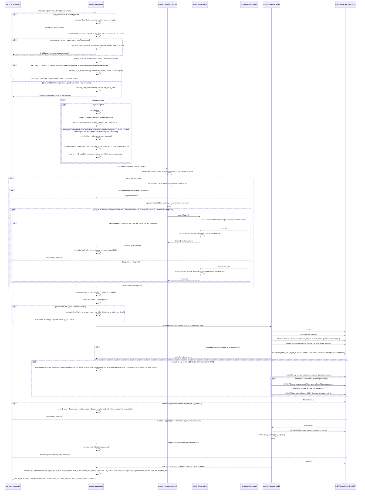
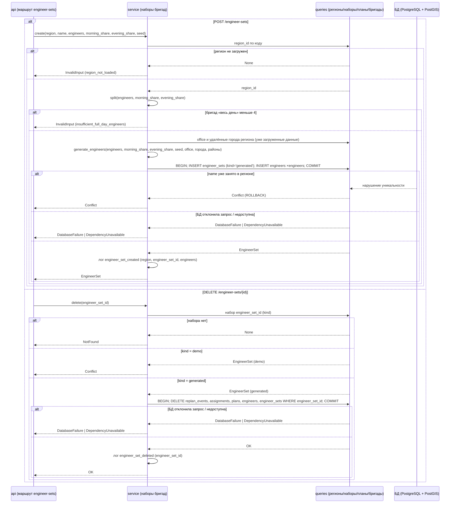
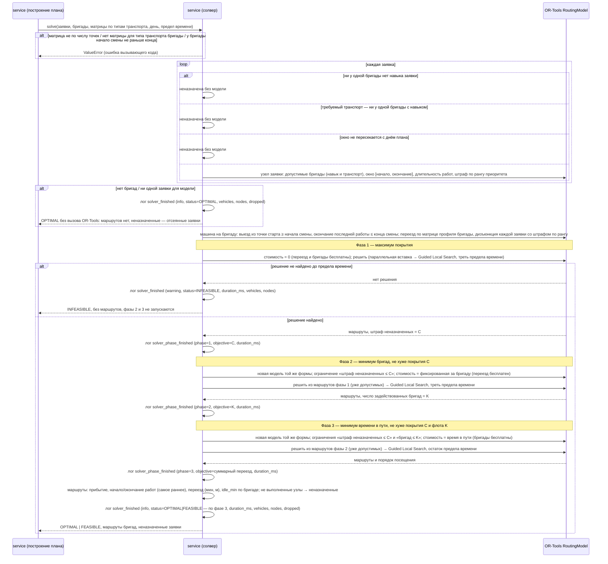
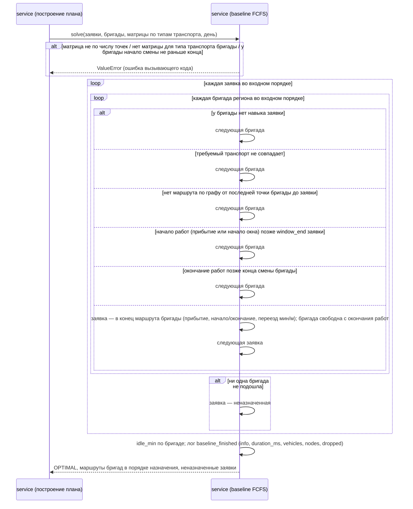
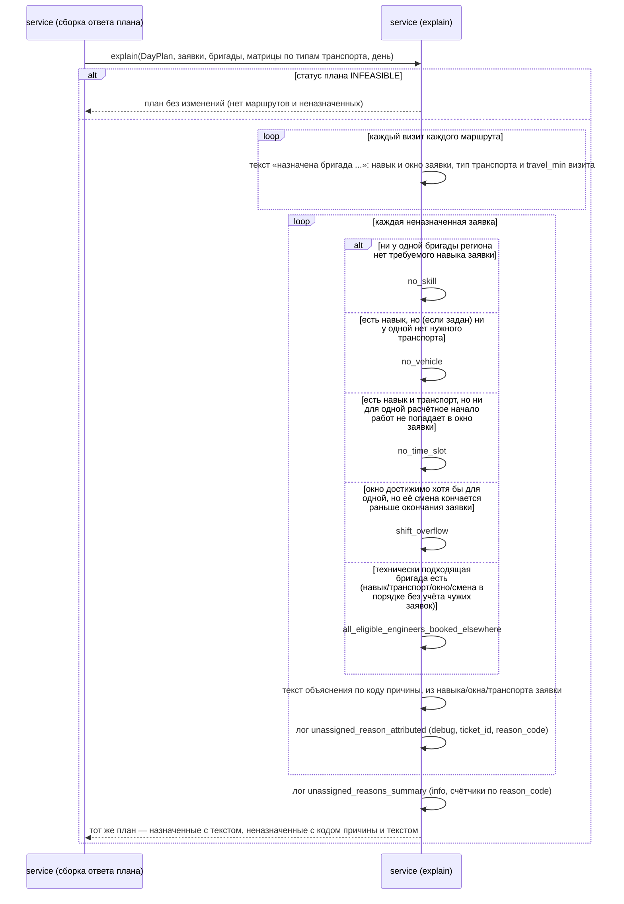
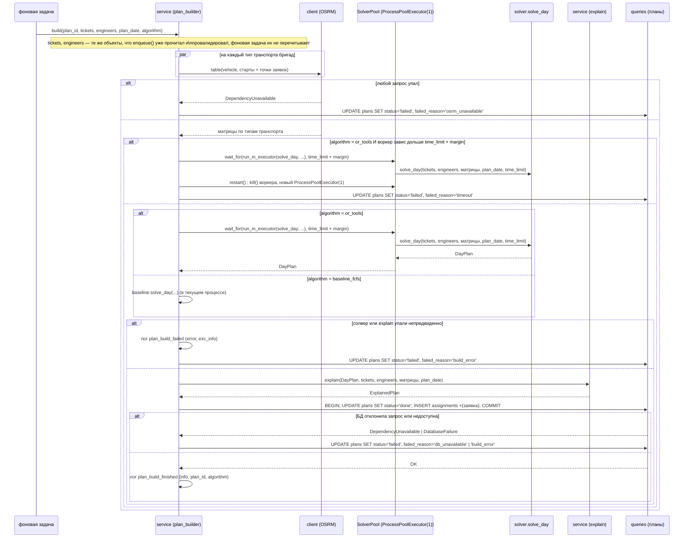
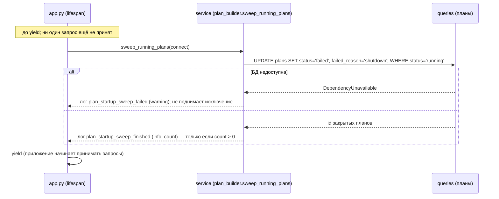
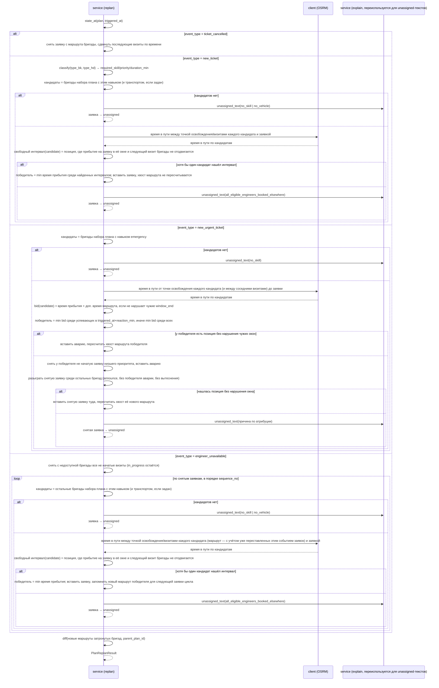
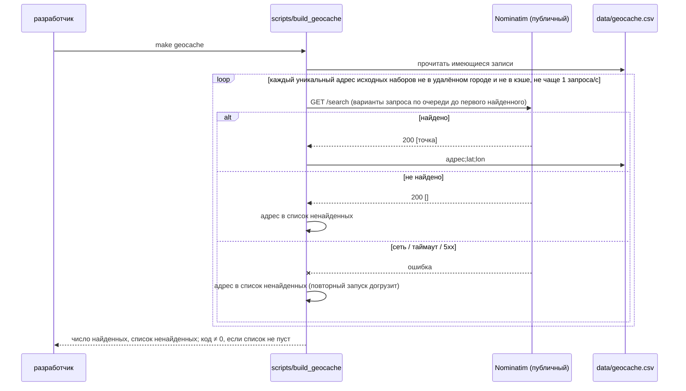

# Sequence-диаграммы — `src/service/`

## Загрузка данных региона

Загрузчик принимает файл заявок одного региона (CSV или JSON) либо встроенный демо-набор
региона и записывает регион, его бригады и заявки в БД. Вызывает его HTTP-слой
(`POST /data/upload`, `POST /data/demo`); коды ответов этих операций — на их диаграммах в
`src/api/routes/`, здесь — исключения сервиса, из которых они получаются по общей схеме
ошибок.

**Регион** выбирает вызывающий по коду (`east`, `south_east`, `south_center`). Код,
название и запасная точка офиса (центр региона) — в конфигурации регионов, не в файле.
Неизвестный код отклоняется до чтения файла.
Все заявки файла относятся к выбранному региону: регион — это один файл.

**Чтение файла.** CSV — разделитель `;`, поля определяются по строке заголовка, а не по
позиции: набор колонок различается между регионами. Из строки сохраняются только колонки,
которые использует загрузчик; заголовок больше 50 колонок — ошибка формата файла: работа над
строкой не должна расти с числом объявленных колонок. Кодировка определяется по содержимому:
файл, начинающийся с UTF-8 BOM, — UTF-8 без BOM; иначе строгий UTF-8; иначе cp1251. Порядок
существен: cp1251 декодирует почти любую последовательность байтов, а кириллица в cp1251
почти никогда не бывает корректным UTF-8. JSON — массив объектов, ключи которых совпадают с
заголовками CSV; только UTF-8, с BOM или без. Файл, который не разбирается как CSV или JSON
(в том числе поле CSV больше предела библиотеки, слишком глубокая вложенность или слишком
длинное число в JSON), — ошибка формата файла.

**Размер файла.** Файл — день региона: все его заявки идут в одну матрицу времени в пути и
один запуск солвера. Файл больше чем с 500 заявками отклоняется целиком; 30 бригад региона
выполняют за день около 300 заявок, остальное — запас на нехватку бригад. Пустые строки и
служебная строка (см. ниже) заявками не считаются и в памяти не держатся — только считаются:
файл из одних пустых строк занимает память не больше файла без них. Разбор выполняется вне
event loop: файл до 1 МБ — это работа процессора, а не ожидание.

**Строки, которые не являются заявками**, отбрасываются до проверки полей и учитываются в
`rows_skipped`: пустые строки и служебная строка, у которой `Заявка` — «Адрес Офиса» или
«Адрес офиса» (регистр между файлами не совпадает). Из служебной строки берётся адрес офиса
региона — он во втором столбце. Без служебной строки офис — центр региона, а адрес офиса —
название региона; адрес офиса, не найденный геокодированием, тоже даёт центр региона.

**Строка-заявка** проверяется по отдельности. Невалидная строка не загружается, не
прерывает загрузку остальных и учитывается в `rows_invalid` с номером строки и причиной:

- поле длиннее предела: адрес — 300 символов, остальные поля — 200;
- нет обязательного поля (`Заявка`, `Тип заявки HD`, `Начало`, `Окончание`, `Адрес`);
- время не в формате `ДД.ММ.ГГГГ Ч:ММ` (час — одна или две цифры: у аварий в исходных
  данных `0:01`) или начало окна не раньше окончания;
- тип заявки отсутствует в таблице соответствия типов;
- значение «Статус BK» отсутствует в таблице соответствия статусов;
- адрес не найден ни в гео-кэше, ни внешним геокодером — заявка без точки не загружается.

**Тип заявки → навык, приоритет, длительность** — по конфигурируемой таблице
соответствия, а не в коде. `Тип заявки HD` = «Авария» даёт навык `emergency`, ранг
приоритета 1 и 80 минут на объекте при любом `Тип заявки BK`. Остальные значения HD дают
навык по таблице, а вид работ (приоритет и минуты на объекте) — по `Тип заявки BK`:
подключение — ранг 2, 70 мин; дозаказ — ранг 3, 20 мин; локальная заявка и прочая
«Глобальная проблема» — ранг 3, 30 мин.

**Статус и момент поступления.** Статус — из колонки «Статус BK» по таблице соответствия
статусов, без колонки — `sent`. Момент поступления — 00:00 даты начала окна: все заявки
файла известны на начало дня. Часы сервера не используются, время нигде не переводится
между поясами.

**Координаты.** Адрес в удалённом городе Подмосковья (Домодедово, Кашира, Ступино — по
району или по названию города в адресе) получает точку города из конфигурации регионов:
такие города обслуживаются как одна точка, а Nominatim по названию города может вернуть,
например, аэропорт. Остальные адреса — сначала статический гео-кэш (`data/geocache.csv`,
собирается разово скриптом по адресам исходных наборов и коммитится). Кэш покрывает каждый
адрес синтетических и контрольных наборов, поэтому демо-набор и файлы исходных наборов
загружаются без доступа к интернету и при выключенном Nominatim. Промах кэша — запрос к
Nominatim, если его адрес задан в настройках; пустой адрес — внешний геокодер выключен, и
промах сразу делает строку невалидной. Запросы к Nominatim идут не чаще одного в секунду на
процесс — при любом числе одновременных загрузок, с User-Agent приложения; найденная точка
живёт в памяти до конца загрузки. За одну загрузку в Nominatim уходит не больше 50
адресов-промахов (настройка): на адрес может понадобиться несколько вариантов запроса, а
публичный сервис запрещает массовое геокодирование; адреса сверх предела остаются без точки.
В запрос не попадают квартира, подъезд, этаж и офис. На стенде Nominatim по умолчанию
выключен. Nominatim недоступен или ответил не результатом поиска (сеть, таймаут, любой код,
кроме `200`, в том числе `403` и `429`; тело не JSON или без координат) — загрузка
прерывается целиком как отказ зависимости: иначе все адреса вне кэша молча стали бы
невалидными строками.

**Наборы бригад.** У региона один или несколько наборов бригад (`engineer_sets`): набор
`default` (`kind=demo`) есть у региона всегда — его создаёт первая загрузка данных
региона с параметрами конфигурации региона (`engineers`, доли смен, `seed` = код
региона) и удалить нельзя; дополнительные наборы (`kind=generated`) создаёт пользователь
отдельной операцией (`POST /engineer-sets`) со своими параметрами. Файла бригад
загрузчик не принимает ни для одного набора. Загрузка заявок региона регенерирует
бригады **каждого** набора региона его же параметрами (по одному разу на набор, тем же
генератором) и обновляет в каждом только точки старта по новому файлу (офис, удалённые
города) — состав, число бригад и их id набора файл не меняет.

**Генератор бригад** детерминирован: для тех же параметров (число бригад, доли утренней
и вечерней смен, seed) он всегда даёт один и тот же состав — названия, навыки, транспорт,
смены; число бригад набора — не больше 30 (проверяется при создании набора и при чтении
конфигурации региона для `default`). От файла загрузки зависят только точки старта (офис
и удалённые города, см. ниже) — у каждого набора независимо. У каждой бригады от 1 до 3
навыков, в наборе встречаются все три навыка и все четыре типа транспорта. Смены — три
вида, часы — общие для всех наборов и регионов (конфигурация сервера), доля бригад
каждого вида — свой параметр набора (`morning_share`/`evening_share` у `default` — из
конфигурации региона, у дополнительного — из `POST /engineer-sets`):

| Смена | Часы | Доля бригад |
|---|---|---|
| утренняя | 10:00–18:00 | 25 % |
| вечерняя | 15:30–23:30 | 25 % |
| весь день | 10:00–23:30 | остальные, не меньше половины |

Число бригад вида — доля (параметр набора) от числа бригад набора с округлением вниз;
остаток получает «весь день». Конец вечерней смены и смены «весь день» — 23:30: прибытие
возможно в любой момент последнего окна (до 22:00), и работа на объекте (не больше 80
минут) успевает закончиться в смене. Бригады «весь день» вместе имеют все три навыка и
все четыре типа транспорта: заявку любого окна по навыку и транспорту может взять хотя бы
одна бригада набора, какие бы смены ни достались остальным; для этого бригад «весь день»
не меньше четырёх — параметры набора, при которых это не выполняется, отклоняются при
создании набора (`POST /engineer-sets`) и при чтении конфигурации региона для `default`.
Каждая смена лежит в пределах одних суток, начало раньше конца. Старт — из офиса региона;
для каждого удалённого города Подмосковья, встречающегося в районах заявок (Домодедово,
Кашира, Ступино), одна бригада набора со сменой «весь день» стартует из точки этого
города.

**Запись в БД** — соединение из пула берётся только здесь, после разбора и геокодирования:
медленный геокодер не держит соединение. Одна транзакция: регион создаётся или обновляется
по коду; события перепланирования, строки планов, планы и заявки региона удаляются — планы
ссылаются на заявки, которых больше нет (это удаляет планы **всех** наборов региона, не
только `default`); новые заявки вставляются. Наборов бригад региона к этому моменту нет
только при самой первой загрузке — тогда создаётся `default` (`kind=demo`) с параметрами
конфигурации региона. Для каждого набора региона (`default` и, если есть, `generated`)
отдельно: сохранённые бригады набора сравниваются с составом его же генератора по
названию, навыкам, транспорту и смене каждой бригады — если состав тот же, у каждой
обновляется точка старта, id сохраняются; если бригад в наборе ещё нет или состав другой
(для `default` — конфигурация региона поменяла число бригад, доли смен; у `generated` так
не бывает — его параметры хранятся в БД и не меняются повторной загрузкой), бригады набора
удаляются и вставляются заново.

Ошибка любого запроса откатывает транзакцию целиком: в БД остаются прежние данные региона.

**Две очереди: разбор и запись.** Файлы разбираются по одному: разбор занимает память и
процессор (с удержанием GIL). Записи в БД тоже идут по одной, и загрузки занимают не больше
одного соединения пула, сколько бы их ни пришло сразу. Геокодирование — вне очередей:
запросы к Nominatim и так разнесены клиентом, а загрузка без промахов кэша не ждёт чужую с
промахами. Файл до 1 МБ разбирается целиком (`json.loads` для JSON); строки CSV из пустых
или пробельных ячеек только считаются, без разбора по колонкам.

Файл, в котором после отбора не осталось ни одной валидной заявки, отклоняется целиком:
загружать регион без заявок бессмысленно, а прежние данные при этом стирались бы.

Каждый отказ загрузки пишется здесь одной записью `data_load_failed` с `reason` и
`duration_ms`: ошибка
входных данных (неизвестный регион, файл, ноль заявок) — на уровне `warning`, отказ БД или
геокодера — `error`; роут её не повторяет.

В записях лога — счётчики и коды причин, без адресов и текста строк: адрес заявки —
персональные данные. Причина невалидной строки уходит вызывающему в итоге загрузки, а не в
лог.

## Наборы бригад: создание и удаление

`engineer_sets.py` — управляет дополнительными наборами бригад региона поверх набора
`default` (тот создаётся и обновляется только загрузчиком, см. выше). Использует тот же
`generate_engineers`, что и загрузчик, но с параметрами из тела запроса, а не из
конфигурации региона; `office` и районы заявок для точек старта берутся из уже
загруженных данных региона (тех же, что видит `GET /engineers` этого региона).

**Создание (`POST /engineer-sets`)**:
1. Код региона — из конфигурации; у региона должны быть загруженные данные (иначе
   строить набор не по чему — `region_not_loaded`).
2. `engineers`/`morning_share`/`evening_share` — в пределах контракта (проверено
   Pydantic); дополнительно — `split(engineers, morning_share, evening_share)` (та же
   функция, что и для `default`) не должен оставлять меньше 4 бригад «весь день» —
   `insufficient_full_day_engineers`, единственная бизнес-проверка этого шага.
3. Генерация состава детерминирована `seed` и остальными параметрами — тот же набор
   параметров всегда даёт тот же состав.
4. `INSERT engineer_sets` (`kind='generated'`) и `INSERT engineers` — одной транзакцией;
   нарушение уникальности `(region_id, name)` (в т.ч. `name='default'`) —
   `name_taken`, `409`.

**Удаление (`DELETE /engineer-sets/{id}`)**: `kind='demo'` отклоняется `409` до начала
удаления — `default` нельзя удалить ни при каких условиях. `kind='generated'` удаляется
вместе со своими бригадами и планами в том же порядке, что и данные региона при
загрузке (события перепланирования → строки планов → планы → бригады → сам набор), но
по `engineer_set_id`, а не по `region_id`: наборы и планы других наборов региона не
трогаются.

## Построение плана дня: модель солвера, ступенчатая (лексикографическая) оптимизация

Солвер назначает заявки одного региона и одного дня бригадам этого региона и строит порядок
посещения. Это чистая функция: на вход — заявки, бригады, матрицы времени и расстояния в
пути и день плана, на выход — маршрут каждой бригады и список неназначенных заявок. Сам
солвер не ходит ни в БД, ни в OSRM: заявки и бригады выбирает, а матрицы запрашивает у OSRM
сервис построения плана, он же вызывает солвер вне event loop — решение занимает процессор
на всё отведённое время.

**Решение — три последовательных прогона одного и того же OR-Tools RoutingModel**, один за
другим, каждый со своей единственной целевой функцией и жёстким ограничением по результату
предыдущего: фаза 1 — максимум взвешенного по приоритету покрытия; фаза 2 — минимум бригад,
не хуже покрытия фазы 1; фаза 3 — минимум суммарного времени в пути, не хуже покрытия и
флота фаз 1–2. Модель (навыки, транспорт, окна, дизъюнкции) не меняется между фазами —
меняется только целевая функция и добавляется ограничение. OR-Tools фиксирует стоимостную
структуру модели на первом решении, поэтому у каждой фазы — своя копия модели; следующая
фаза стартует с маршрутов предыдущей (уже допустимых для её ограничения), а не с нуля.
Однопроходный вариант с одной взвешенной целевой функцией (три слагаемых разного масштаба
вместо трёх фаз) существует только как база сравнения теста этого changeset'а: у одного
эвристического прогона нет гарантии соблюдения иерархии целей, только уклон к ней через
масштаб.

**Время** — целые минуты от полуночи дня плана; наивное локальное время региона, без
перевода между поясами. Время в пути из матрицы (секунды) округляется вверх до целой минуты:
план не обещает прибытие раньше, чем бригада доедет. Все моменты плана — с точностью до
минуты.

**Узлы.** Точка старта каждой бригады и точка каждой заявки. Матрица каждого типа транспорта
бригад — по одним и тем же точкам в одном порядке: сначала старты бригад, затем заявки.
Бригада с общественным транспортом получает матрицу профиля `car` с коэффициентом — это
делает клиент OSRM. Пара точек без маршрута по графу — переезд между ними невозможен.

**Бригада = одна «машина» OR-Tools.** Маршрут начинается в точке старта бригады не раньше
начала её смены и заканчивается окончанием работ на последней заявке не позже конца смены:
переезды и работы на объектах укладываются в смену. Обратный путь к точке старта в
занятость не входит — маршрут открытый.

**Допустимость заявки для бригады** — жёсткое ограничение, не штраф: у бригады есть
требуемый навык заявки и, если заявка требует тип транспорта, у бригады именно он. Заявку,
для которой нет ни одной допустимой бригады, солвер не рассматривает и сразу возвращает
неназначенной.

**Временное окно** — жёсткое: работа на заявке начинается внутри `[window_start,
window_end]`. Бригада, приехавшая раньше начала окна, ждёт. Прибытие = окончание
предыдущей работы (или выезд из точки старта) + время в пути по матрице профиля бригады;
норматив «дорога 20 мин» не используется. Длительность работ — `duration_min` заявки. Окно,
не пересекающееся с днём плана, делает заявку неназначаемой.

**Частичное покрытие.** Любую заявку солвер может оставить без назначения со штрафом по её
приоритету. Штраф заявки более срочного ранга больше суммы штрафов всех заявок менее срочных
рангов: ни одна авария не остаётся неназначенной ради любого числа подключений, ни одно
подключение — ради ремонтов и дозаказов.

**Целевая функция каждой фазы нацелена на одну величину**, но не сводится к ней одной: у
OR-Tools штраф неназначенной заявки из дизъюнкции всегда входит в `ObjectiveValue`, какую бы
стоимость машины и переезда ни задавала фаза, — фаза 2 не может выключить его, а лишь
уравновешивает своей стоимостью бригад, фаза 3 — своей стоимостью переезда. Фаза 1
минимизирует именно этот штраф (штраф заявки более срочного ранга больше суммы штрафов всех
заявок менее срочных рангов — ни одна авария не остаётся неназначенной ради любого числа
подключений, ни одно подключение — ради ремонтов и дозаказов); фаза 2 минимизирует
фиксированную стоимость задействованных бригад при жёстком ограничении «штраф неназначенных
не больше значения фазы 1»; фаза 3 минимизирует суммарное время в пути при том же
ограничении по покрытию и ограничении «число бригад не больше значения фазы 2». Ограничения
между фазами — это переменные `ActiveVar`/`NextVar` модели, взятые в жёсткое неравенство
(`Solver.Add`), а не приближение через масштаб: следующая фаза математически не может
оставить больше неназначенных или занять больше бригад, чем показала предыдущая — но может
оставить меньше или занять меньше: ограничение не запрещает случайно найденное решение лучше
уровня предыдущей фазы, оно только запрещает решение хуже.

**Поиск на каждой фазе:** первое решение — маршруты предыдущей фазы (для фазы 1 — параллельная
вставка по наименьшей стоимости), затем Guided Local Search до её доли предела времени,
заданного вызывающим (поровну на фазу). Решение фазы, найденное до предела, возвращается как
`FEASIBLE`, доказанный оптимум — `OPTIMAL`; итоговый статус плана — статус фазы 3. Если фаза 1
не находит решения до предела, солвер возвращает `INFEASIBLE` без маршрутов сразу, не запуская
фазы 2 и 3, — план «все заявки не назначены» из-за нехватки времени на поиск выглядел бы как
настоящий. Фазы 2 и 3 стартуют с маршрутов предыдущей фазы, которые уже удовлетворяют новому
ограничению, поэтому у них решение есть всегда.

**Результат.** Для каждой бригады — упорядоченные визиты: заявка, плановое прибытие, начало
и окончание работ, время (минуты) и расстояние (метры) переезда к ней; бригада без визитов в плане не
задействована. Начало работ — самое раннее, допустимое маршрутом. `idle_min` бригады — длина
её смены минус суммарное время визитов и переездов (вся смена, если бригада не задействована);
поле только для отображения, в целевую функцию ни одной фазы не входит. Для неназначенных —
id заявки; причину отказа определяет отдельная процедура атрибуции, а не солвер. Без бригад
или без единой заявки, которую можно отдать модели, OR-Tools не вызывается: результат
известен — `OPTIMAL`, маршрутов нет.

Размер входа ограничен до солвера: в регионе не больше 30 бригад, в файле не больше 500
заявок. Матрица, не совпадающая по числу точек с бригадами и заявками, нет матрицы для типа
транспорта одной из бригад, или у бригады начало смены не раньше конца, — ошибка вызывающего
кода (`ValueError`), а не входных данных: смена такой формы уже отклонена ограничением схемы
на этапе загрузки.

В лог попадают только счётчики и статус: ни адресов, ни точек, ни id заявок.

## Построение плана дня: baseline (FCFS)

Baseline — самостоятельная от солвера чистая функция с тем же контрактом ввода/вывода:
заявки, бригады, матрицы времени и расстояния в пути по типам транспорта и день плана на
входе, маршрут каждой бригады и список неназначенных заявок (те же типы `DayPlan`,
`EngineerRoute`, `Visit`, что и у солвера) на выходе — так план солвера и baseline сравнимы
по составу метрик без отдельного маппинга. Реализация не использует OR-Tools и не ссылается
на модель солвера: последовательный проход без поиска и без возврата к более раннему
решению.

**Алгоритм — один проход по заявкам во входном порядке**, без переупорядочивания и без
глобальной оптимизации: для каждой заявки перебираются бригады региона в порядке, в котором
они пришли на вход, и заявка уходит первой подходящей. Подходит бригада, у которой есть
требуемый навык заявки и, если заявка требует конкретный тип транспорта, — именно он, и для
которой вставка заявки в конец её текущего маршрута не нарушает окно заявки и не выходит за
конец смены. Первая такая бригада получает заявку сразу, без сравнения с другими
подходящими; порядок посещения бригады — порядок, в котором её заявки были назначены.
Заявка, для которой не нашлось подходящей бригады, — неназначенная; причину отказа
определяет отдельная процедура атрибуции, не baseline.

**Вставка в конец маршрута.** У бригады есть точка, из которой поедет следующий переезд: это
точка старта бригады, если у неё ещё нет ни одной заявки, иначе — точка последней
назначенной заявки. Время в пути и расстояние до заявки берутся из матрицы профиля бригады
по этой паре точек; пары без маршрута по графу (`None` в матрице) исключают бригаду для этой
заявки. Время в пути (секунды) округляется вверх до целой минуты — тот же норматив, что у
солвера, «дорога 20 мин» не используется. Прибытие = момент, когда бригада освобождается
после предыдущей работы (или начало смены, если заявок ещё нет) + время в пути. Начало
работ — прибытие, либо начало окна заявки, если бригада приехала раньше него. Заявка
подходит бригаде, только если начало работ не позже `window_end` заявки и окончание работ
(начало + `duration_min`) не позже конца смены бригады.

**Результат.** Для каждой бригады — маршрут в порядке назначения: заявка, плановое
прибытие, начало и окончание работ, время (минуты) и расстояние (метры) переезда к ней;
бригада без заявок в плане не задействована. `idle_min` бригады — длина её смены минус
суммарное время работ и переездов (вся смена для бригады без заявок) — то же определение,
что у солвера, для одинаковой формы метрик. Статус плана — всегда `OPTIMAL`: baseline не
ищет решение и не может его не найти, он либо назначает заявку по правилу, либо оставляет её
неназначенной.

В лог попадают только счётчики и статус: ни адресов, ни точек, ни id заявок.

## Атрибуция причины отказа и генерация объяснений

Чистая функция, независимая и от солвера, и от baseline: принимает уже построенный `DayPlan`
(любой из двух — солвер или baseline) вместе с теми же заявками, бригадами и матрицами по
типам транспорта, что были переданы алгоритму, и возвращает план того же вида, где у каждой
строки — назначенной или нет — есть непустой человекочитаемый текст, а у неназначенной ещё и
код причины. Ни солвер, ни baseline код причины не определяют: солвер знает только штраф
`AddDisjunction`, baseline — только то, что ни одна бригада не подошла по его собственному
правилу «первая подходящая», ни один из них не смотрит, какое именно ограничение из групп не
пропустило заявку.

**Процедура атрибуции** — последовательная проверка по группам ограничений, без учёта
фактического маршрута бригады (только её точка старта и её собственная смена): берётся первая
группа, после которой не осталось ни одного кандидата.

1. Навык — кандидаты сужаются до бригад с требуемым навыком заявки; если ни одной — `no_skill`.
2. Транспорт — если заявка требует конкретный тип, кандидаты сужаются до него; если ни одной —
   `no_vehicle`.
3. Окно/смена — для каждого оставшегося кандидата: расчётное прибытие = начало его смены +
   время в пути (OSRM, профиль бригады) от точки старта до заявки; начало работ — прибытие или
   начало окна заявки, если бригада приехала раньше; кандидат подходит, если начало работ не
   позже `window_end` и окончание работ (начало + `duration_min`) не позже конца смены. Пара
   точек без маршрута по графу исключает кандидата так же, как непройденное окно. Если ни для
   одного кандидата начало работ не попадает в окно — `no_time_slot`; если хотя бы для одного
   окно достижимо, но у всех таких не хватает смены — `shift_overflow`.
4. Оборудование — шаг пропускается: оборудование не моделируется как ограничение, поэтому
   код `no_equipment` этой процедурой не возвращается.
5. Кандидат, прошедший шаги 1–4, есть, но заявка всё равно не назначена — все такие бригады в
   это время заняты другими заявками: `all_eligible_engineers_booked_elsewhere`.

План со статусом `INFEASIBLE` (без маршрутов и без неназначенных, раздел выше) проходит через
функцию без изменений — атрибутировать и объяснять нечего.

**Текст объяснения назначенной заявки** — из навыка заявки, её собственного окна (`window_start`
–`window_end`, не расчётного времени начала работ), типа транспорта и времени в пути визита;
внутренние поля модели солвера (allowed vehicles, dimension slack) не читаются — то же самое
известно из заявки, бригады и уже посчитанного визита. Текст неназначенной — из кода причины и
тех же навыка/окна/транспорта заявки; для `all_eligible_engineers_booked_elsewhere` — ещё число
технически подходящих бригад.

В лог попадают код причины и id заявки (не адрес и не текст объяснения) на уровне `debug` —
по объёму сравнимо с числом заявок дня, полезно только при отладке; итоговые счётчики по
каждому коду — один раз, на уровне `info`.

## Сборка плана: `POST /plan/build`

`plan_builder.py` — оркестратор построения: связывает загрузчик региона, OSRM-клиент,
солвер (`solve_day` из раздела выше, или baseline), `explain` и репозиторий планов;
собственных бизнес-правил о назначении заявок не содержит. Работает в двух частях:
проверки и постановка в очередь — в теле запроса, до ответа `202`; сама сборка — в
фоновой задаче после ответа. Полная диаграмма запроса, включая постановку в очередь,
ветки контроллера и единый обработчик ошибок, — в разделе API-слоя про
`POST /api/v1/plan/build`; здесь — то, что специфично для фоновой сборки.

`engineers` — бригады одного набора бригад региона (`engineer_set_id` из запроса, без
него — набор `default`), не всех наборов сразу; `plans.engineer_set_id` хранит, какого
набора этот план, и не меняется до конца его жизни (в т.ч. при перепланировании).

**Проверки до постановки в очередь**, по порядку (первая же непройденная —
`InvalidInput`, без записи `plans` и без обращения к OSRM или солверу):
1. У региона есть загруженные данные (`region_id` не `None`); переданный
   `engineer_set_id` принадлежит этому региону (без него — берётся `default`-набор
   региона).
2. У каждой открытой заявки региона (`status NOT IN ('completed', 'cancelled')`)
   `window_start.date() == plan_date`: смены бригад считаются от `plan_date`, и заявка
   другой даты сделала бы модель солвера бессмысленной без единого явного сигнала об
   этом на выходе.
3. `len(engineers) + len(tickets) <= settings.osrm_max_table_size`: за пределом OSRM сам
   отклоняет запрос `/table`, а до этого предела дело не доходит — файл заявок и
   конфигурация региона уже ограничивают его 500 и 30 (раздел 6, 7), проверка здесь —
   защита от несогласованной конфигурации, а не рабочий сценарий.

**Матрицы OSRM** — по одной на каждый представленный в регионе тип транспорта
(`{e.vehicle_type for e in engineers}`), точки — старты бригад, затем точки заявок в
порядке `tickets` (тот же порядок, что берут `solve_day` и `explain`); типы транспорта не
использует ни одна бригада — не запрашиваются. Запросы идут одновременно
(`asyncio.TaskGroup`), а не по очереди: один недоступный граф не блокирует остальные —
первая же ошибка отменяет ещё не завершённые запросы и результат — построение завершается
со `status=failed`, `failed_reason=osrm_unavailable`.

**Солвер вне event loop.** `or_tools.solve_day` не отдаёт GIL на всё время поиска —
известное ограничение нативного решателя, — поэтому вызывается через
`loop.run_in_executor` в `ProcessPoolExecutor(max_workers=1)`, общем на всё приложение
(создаётся в `lifespan`, живёт с приложением): второй одновременный вызов `or_tools`
встаёт в очередь исполнителя, а не запускается параллельно вторым процессом — сервер
строит не больше одного плана `or_tools` одновременно.
В процесс уходят только простые данные (`Ticket`/`Engineer` — `pydantic.BaseModel`,
`TravelMatrix` — `@dataclass`, оба сериализуемы `pickle`); объекты `RoutingModel`
процесс не пересекают. `baseline_fcfs` не заводится в пул — линейный проход по входу
дня измерен в единицы мс (changeset 12) и не блокирует event loop заметно дольше самого
вызова. Так как клиент не ждёт ответа на этот вызов синхронно, а опрашивает
`GET /plan/{plan_id}`, общего дедлайна на весь путь сборки нет: своё время ограничивают
только сам OSRM-клиент, `time_limit` солвера и — как крайняя защита — таймаут-вотчдог
вокруг `run_in_executor` самого себя (ниже).

**Watchdog зависшего `or_tools`.** `time_limit` — это бюджет, который сам солвер
получает и обязан соблюдать; watchdog защищает от случая, когда солвер (или сам
процесс-воркер) не соблюдает его — завис, не отвечает на внутренний дедлайн, убит ОС
не полностью. `run_in_executor` оборачивается в `asyncio.wait_for` с таймаутом
`SOLVER_TIME_LIMIT_S + SOLVER_WATCHDOG_MARGIN_S` — запас поверх собственного бюджета
солвера, чтобы не считать зависанием штатное завершение впритык к `time_limit`. По
истечении: `SolverPool.restart()` убивает единственный воркер (`Process.kill()`) и
поднимает на его месте новый `ProcessPoolExecutor(max_workers=1)` — простой `kill()`
без пересоздания оставил бы исполнитель битым (`BrokenProcessPool`) для всех
последующих `or_tools`-сборок до перезапуска приложения, а `baseline_fcfs` пул вообще
не использует и не пострадал бы. Билд, чей воркер убит, завершается как любой другой
отказ — `status='failed', failed_reason='timeout'` через уже существующий
`PlanBuilder._fail`; никакого отдельного пути ошибки для этого случая нет.

Постановка `or_tools`-вызова на `self.pool.executor` и ожидание его результата обёрнуты
в `PlanBuilder._or_tools_lock` (`asyncio.Lock`): без него второй, ещё не начавший
исполняться билд мог бы стоять в очереди того же `ProcessPoolExecutor` позади зависшего
первого — тогда `restart()`'s `cancel_futures=True` отменил бы и его future заодно, а
получившийся `asyncio.CancelledError` (это `BaseException`, не `Exception`) улетел бы из
фоновой задачи необработанным, и этот второй план навсегда остался бы `running`. Лок
гарантирует, что на исполнителе никогда не лежит больше одного future — `restart()`
всегда попадает ровно в тот, который был зависшим.

**Персист** — статус план проходит в БД через прямое присваивание поля, без
промежуточных состояний в памяти между шагами:
1. При постановке в очередь (ещё в теле запроса) — `INSERT` строки `plans` со
   `status='running'`, без строк `assignments`; это и есть план, который сразу же
   возвращает `202` с `plan_id`.
2. По завершении фоновой сборки — одной транзакцией: `UPDATE plans SET status='done'`
   и `INSERT` по одной строке `assignments` на каждую открытую заявку (назначенная —
   `engineer_id`, `sequence_no`, `planned_arrival` = `Visit.arrival`, `travel_time_min`,
   округлённый до целых метров `travel_distance_m`; неназначенная —
   `unassigned_reason`), `explanation` — у обеих.
3. При ошибке на любом шаге (OSRM, солвер, БД) — `UPDATE plans SET status='failed',
   failed_reason=...`, без строк `assignments`.

Ошибка внутри транзакции шага 2 откатывает только эту транзакцию: план остаётся
`status='running'` до следующей попытки записи в этом же вызове — фонового
повторного запуска нет, а если процесс backend перезапустится, пока план в статусе
`running`, план так и останется `running` навсегда — перестроить его можно только
новым запросом `POST /plan/build`.

## Sweep зависших планов при старте приложения

Дополняет watchdog выше для случая, когда сборка обрывается не из-за собственного
зависания, а из-за остановки самого `backend`: `lifespan`'s `finally` не пытается
дождаться идущей сборки и записать её исход — на выходе БД/пул соединений могут уже
закрываться, а сам процесс может быть добит `SIGKILL` оркестратора по истечении его
grace period раньше, чем запись успеет пройти. Поэтому `finally` лишь просит
`SolverPool` завершиться быстро (`shutdown(cancel_futures=True)`, без ожидания и без
попытки писать в БД) и выходит; занятый воркер `shutdown()` убивает тем же `kill()`,
что и `restart()` — иначе, не будучи демоном (`ProcessPoolExecutor` перестал их
помечать демонами начиная с Python 3.9), он пережил бы родителя и остался сиротой,
работающим неограниченно. Планы, не успевшие дойти до `done`/`failed`, остаются
`running` в БД.

`sweep_running_plans` закрывает их при следующем старте — **до** `yield` в `lifespan`,
то есть до того, как приложение начинает принимать запросы: `UPDATE plans SET
status='failed', failed_reason='shutdown' WHERE status='running'` одним запросом, по
всем регионам сразу (сама sweep-проверка не различает регионы — при одном инстансе
`backend` на БД любой `running`-план на старте не может быть чужим). Если на старте
недоступна сама БД — sweep логирует это и не блокирует запуск: `backend` поднимается,
а зависшие с прошлого раза планы останутся `running` до следующего перезапуска.

## Перепланирование: Contract Net

`replan.py` — реализует Contract Net Protocol (Smith 1980) для `new_urgent_ticket`, и,
рядом с ним, более простую вставку в свободный интервал для `new_ticket` (обычная
заявка, поступившая в течение дня) и `engineer_unavailable` (заявки, снятые с
недоступной бригады) — в обоих случаях без объявления задания и без вытеснения — и
снятие заявки для `ticket_cancelled`. Не запускает солвер заново — минимальное изменение
(`plan_stability`) достигается тем, что задача решается локальным поиском по
бригадам-кандидатам, а не полным пересчётом дня. Общих со `solver.py` внутренних
структур не использует (тот построен вокруг `RoutingModel`, непригоден для точечной
вставки одной заявки в уже стоящий маршрут); проверки навык/транспорт/окно/смена
написаны заново по образцу `baseline.py`, но против фактического маршрута бригады, а
не пустого расписания.

**Состояние на `triggered_at`** — общий первый шаг для любого события:
- заявки `completed`/`cancelled` исключаются из маршрутов бригад;
- заявка `in_progress` — заморожена: бригада считается свободной в точке этой заявки не
  раньше её планового окончания (`Visit.arrival + duration_min`), сама заявка не
  снимается, не переносится и не участвует в вытеснении;
- заявки `en_route` и ещё не начатые остаются в маршруте бригады, но их можно
  переставить или снять;
- у бригады без начатой на `triggered_at` работы точка и время освобождения — её
  последний завершённый визит (или точка старта, если визитов ещё не было) и `triggered_at`.

**`new_urgent_ticket` — объявление задания (Contract Net announce)**:
1. Кандидаты — бригады набора плана с навыком `emergency` (без кандидатов — сразу
   `unassigned`, причина `no_skill`, каскад не запускается).
2. Ставка кандидата — время прибытия на аварию из его состояния на `triggered_at` плюс
   доп. время маршрута, если авария вставляется не последним визитом; заявки, уже
   стоящие в маршруте кандидата после точки вставки, не должны выйти за свои `window_end`
   (иначе кандидат не даёт ставку для этой позиции).
3. Победитель — минимальная ставка среди кандидатов, успевающих в `triggered_at +
   reaction_min`; если таких нет — минимальная ставка среди всех кандидатов (превышение
   реакции идёт в `explanation` визита аварии).
4. Если у победителя нет позиции без нарушения чужих окон — **вытеснение (eviction)
   глубиной 1**: снимается не начатая заявка победителя самого низкого приоритета из
   мешающих вставке; она разыгрывается тем же способом среди **остальных** бригад
   (шаги 1–3, без бригады-победителя аварии), но без собственного вытеснения — если и
   там нет позиции без нарушения её окна, вытесненная заявка уходит в `unassigned`
   (причина — та же процедура атрибуции, что у `explain.py`). Второго уровня вытеснения
   нет: заявка, вставленная на место вытесненной, дальше не проверяется на то, не стоит
   ли и её вытеснить.
5. Оставшаяся часть маршрута бригады-победителя (визиты после точки вставки)
   пересчитывается по времени, но не переставляется.

**`new_ticket` — вставка в свободный интервал (не Contract Net: без объявления и без
вытеснения)**:
1. Проверки входа до всякого поиска бригады: `window_start < window_end`
   (`window_order`), обе даты окна совпадают с датой плана-родителя
   (`window_date_mismatch` — то же ограничение, что `plan_builder._validate_window`
   накладывает на построение с нуля), пара (`type_bk`, `type_hd`) есть в таблице
   соответствия типов заявок (`ticket_type_unknown`) — она же даёт
   `required_skill`/`priority`/`duration_min`, как при загрузке файла.
2. Кандидаты — бригады набора плана с этим навыком и (если заявка требует конкретный
   транспорт) с этим транспортом; без кандидатов — сразу `unassigned` (`no_skill` или
   `no_vehicle`, вытеснение не запускается).
3. У каждого кандидата ищется свободный интервал его фактического маршрута на
   `triggered_at` (включая интервал перед первым визитом и после последнего, до конца
   смены): заявка вставляется в интервал, только если прибытие на неё попадает в её
   окно и это **не отодвигает** ни один уже стоящий визит бригады — прибытие на
   следующий по счёту визит (или окончание работы над новой заявкой, если интервал
   последний) не позже, чем в уже посчитанном маршруте-родителе. Более ранняя часть
   маршрута кандидата (до найденного интервала) не пересчитывается вовсе.
4. Среди всех бригад-кандидатов и всех их свободных интервалов побеждает вариант с
   наименьшим временем прибытия на новую заявку; нет ни одного подходящего интервала —
   заявка `unassigned` (`all_eligible_engineers_booked_elsewhere`).
5. Только маршрут бригады-победителя меняется: до найденного интервала — без изменений
   (копии из плана-родителя), дальше — новый визит, затем прежний хвост без изменений,
   со сдвинутыми на 1 порядковыми номерами.

**`ticket_cancelled`**: заявка убирается из маршрута своей бригады, последующие визиты
этой бригады сдвигаются по времени пересчётом от точки перед снятой заявкой; маршруты
остальных бригад не трогаются — раздача заново (Contract Net announce) не запускается,
это не задание, а высвобождение интервала.

**`engineer_unavailable`**: бригады с `engineer_id` нет в наборе плана — `404`
(`engineer_not_found`). У неё снимаются все ещё не начатые визиты (`state_at` уже даёт
это разбиение — `in_progress` визит остаётся заморожен на бригаде, маршрут остальным
не трогается). Каждая снятая заявка, **по одной, в исходном порядке `sequence_no`**,
проходит тот же поиск свободного интервала, что и `new_ticket` (кандидаты — бригады
набора плана, кроме недоступной, с нужным навыком и транспортом; без вытеснения), но
уже против фактического маршрута каждой другой бригады **с учётом заявок, уже
переставленных этим же событием** — так вторая снятая заявка не встаёт в тот же
интервал, что и первая. Не нашлось интервала ни у одной бригады — заявка `unassigned`
(`all_eligible_engineers_booked_elsewhere`, либо `no_skill`/`no_vehicle`, если
подходящих по навыку/транспорту бригад вообще нет). Сама недоступная бригада остаётся
в ответе без не начатых визитов; последующие события снова могут назначать ей заявки.

**`diff`** считается сравнением новых маршрутов затронутых бригад со старыми
(`parent_plan_id`): `changed_assignments` — заявки, у которых сменилась бригада и/или
`sequence_no`; `newly_assigned`/`newly_unassigned` — заявки, появившиеся или пропавшие
из назначений; `plan_stability` — число бригад, чей маршрут отличается от
`parent_plan_id`; `reassigned_from_unavailable_engineer` — заявки, успешно
переставленные событием `engineer_unavailable` (для остальных типов событий — всегда
пуст).

Логирование: `plan_replan_finished` (info) — `plan_id`, `parent_plan_id`, `event_type`,
`plan_stability`; `plan_replan_failed` (warning для входных/конфликтных причин, error для
зависимостей и БД) — `plan_id`, `event_type`, `reason`. Ни то, ни другое не пишет адрес
или координаты заявки.

## Сборка гео-кэша (разово, вне приложения)

`make geocache` собирает `data/geocache.csv` по уникальным адресам исходных наборов
(`docs/synthetic_data`, `docs/control_distribution`) через публичный Nominatim — один запрос
в секунду, с User-Agent проекта. Адреса удалённых городов Подмосковья в кэш не пишутся:
их точка — в конфигурации регионов. Запрос — «улица, дом, Москва» без квартиры; если не
найдено — тип улицы перед названием, порядковый номер перед типом («2-я улица
Синичкина»), затем дом без корпуса и строения.
Ненайденные адреса скрипт выводит списком и в файл не пишет: точку для них задают
вручную, а не подставляют молча. Кэш считается собранным, когда в нём есть каждый адрес
исходных наборов, — это проверяет тест без доступа к сети.

